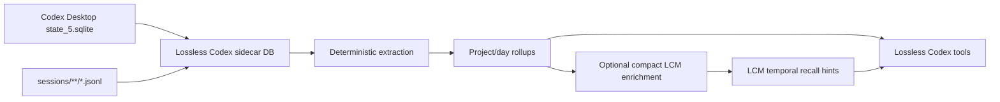
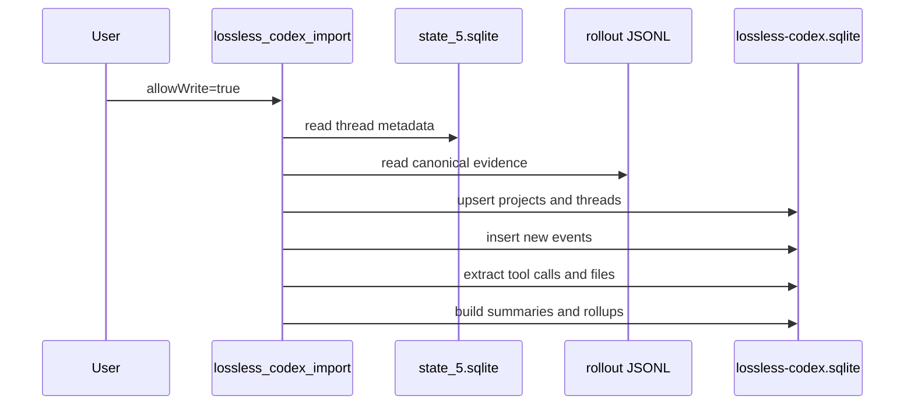

# Lossless Codex Full Memory Plugin and LCM Enrichment Bridge

## Summary

Lossless Codex is a Codex Desktop memory sidecar for coding work. It keeps the
existing `plugins/codex-lcm-reader` bridge read-only and adds a sibling
`plugins/lossless-codex` plugin backed by a separate SQLite database:
`${CODEX_HOME:-~/.codex}/lossless-codex.sqlite`.

The sidecar treats Codex sessions as coding work, not generic chat. It imports
Codex state and JSONL evidence into project, thread, turn, event, tool-call,
touched-file, observation, summary, and project/day rollup tables. It can then
write a small temporal enrichment row into main LCM only when explicitly enabled.



## Scope Boundaries

The existing `codex-lcm-reader` plugin remains a safe read-only adapter over the
OpenClaw LCM database. It exposes `lcm_grep`, `lcm_describe`, `lcm_expand`, and
`lcm_expand_query`, and keeps SQLite opened with `PRAGMA query_only = ON`.

The new `lossless-codex` plugin owns only the Codex sidecar DB and optional LCM
enrichment rows. It does not mutate Codex live prompt context. It does not dump
raw Codex transcripts, tool outputs, patch diffs, or log bodies into LCM.

## Sidecar Schema

The sidecar schema is coding-work first:

- `codex_projects`
- `codex_threads`
- `codex_turns`
- `codex_events`
- `codex_tool_calls`
- `codex_touched_files`
- `codex_observations`
- `codex_log_metadata`
- `codex_summaries`
- `codex_summary_events`
- `codex_summary_parents`
- `codex_project_day_rollups`
- `codex_import_watermarks`
- `codex_jobs`

`codex_observations` uses observed, non-authoritative coding labels:

- `outcome`
- `decision`
- `tradeoff`
- `architecture_note`
- `file_change`
- `test_result`
- `blocker`
- `follow_up`
- `risk`

Each observation stores a confidence, rationale, status, and source event refs.

## Import And Extraction

The initial importer reads `state_5.sqlite` thread metadata and rollout JSONL
evidence. It extracts deterministic coding facts first:

- thread and turn boundaries
- tool calls and statuses
- patch/apply evidence
- touched file paths
- command/test metadata through tool-call records
- subagent spawn edges from `thread_spawn_edges`
- thread summaries and project/day rollups
- `logs_2.sqlite` metadata such as level, target, file, line, and thread id,
  with log bodies excluded by default and represented only by hashes

The importer is idempotent. Re-importing the same source does not duplicate
events. If a rollout JSONL source is truncated or rotated, the sidecar records a
new source generation so old evidence and new evidence do not collide.

Copied-DB rehearsals prefer rollout JSONL under the configured
`LOSSLESS_CODEX_SOURCE_DIR` even when the copied `state_5.sqlite` still contains
live absolute paths. That keeps production rehearsals from accidentally reading
the user's active Codex session files.



## Tools

The plugin exposes:

- `lossless_codex_status`: report DB path, source path, counts, config, and
  privacy posture.
- `lossless_codex_import`: explicit sidecar indexing entry point.
- `lossless_codex_search`: bounded search over coding memory cues.
- `lossless_codex_recent`: temporal project/day rollup lookup.
- `lossless_codex_describe`: proof-oriented drilldown for threads, summaries,
  observations, touched files, and refs.
- `lossless_codex_worklog`: coding-work answer surface for "what did Codex build"
  with optional LCM enrichment write.

Raw expansion is intentionally absent from default responses. Exact claims should
follow `lossless-codex://...` refs back to sidecar events or the original JSONL.

## LCM Enrichment

Main LCM receives only small temporal rows when enrichment is enabled:

```sql
CREATE TABLE IF NOT EXISTS lcm_temporal_enrichments (
  enrichment_id TEXT PRIMARY KEY,
  source_system TEXT NOT NULL,
  period_kind TEXT NOT NULL CHECK (period_kind IN ('day', 'week', 'month')),
  period_key TEXT NOT NULL,
  timezone TEXT NOT NULL,
  project_key TEXT NOT NULL,
  summary TEXT NOT NULL,
  payload_json TEXT NOT NULL,
  source_ref TEXT NOT NULL,
  coverage_status TEXT NOT NULL DEFAULT 'complete',
  created_at TEXT NOT NULL DEFAULT (datetime('now')),
  updated_at TEXT NOT NULL DEFAULT (datetime('now')),
  UNIQUE (source_system, period_kind, period_key, timezone, project_key)
);
```

The payload is compact and points back to Lossless Codex:

```json
{
  "projectsWorked": [
    {
      "projectKey": "lossless-claw",
      "threadCount": 4,
      "summary": "Codex worked on Lossless Codex sidecar and LCM enrichment.",
      "observations": {
        "decisions": 3,
        "tradeoffs": 2,
        "architectureNotes": 5,
        "filesTouched": 1,
        "openQuestions": 2
      },
      "sidecarRefs": [
        "lossless-codex://project-day/lossless-claw/2026-05-04",
        "lossless-codex://thread/019dd3c9..."
      ]
    }
  ]
}
```

LCM should treat these rows as temporal hints, not proof. If an agent needs more
detail, it should call `lossless_codex_search` or `lossless_codex_describe`.

## Config Defaults

- `LOSSLESS_CODEX_ENABLED=false`
- `LOSSLESS_CODEX_DB_PATH=${CODEX_HOME:-~/.codex}/lossless-codex.sqlite`
- `LOSSLESS_CODEX_SOURCE_DIR=${CODEX_HOME:-~/.codex}`
- `LOSSLESS_CODEX_INDEXER_ENABLED=false`
- `LOSSLESS_CODEX_READ_ONLY=true`
- `LOSSLESS_CODEX_INCLUDE_MESSAGE_TEXT=false`
- `LOSSLESS_CODEX_INCLUDE_TOOL_OUTPUTS=false`
- `LOSSLESS_CODEX_INCLUDE_LOG_BODIES=false`
- `LOSSLESS_CODEX_SUMMARY_MODEL=""`
- `LOSSLESS_CODEX_SUMMARY_PROVIDER=""`
- `LOSSLESS_CODEX_SUMMARY_MAX_CONCURRENCY=1`
- `LOSSLESS_CODEX_TIMEZONE=UTC`
- `LOSSLESS_CODEX_LCM_ENRICHMENT_ENABLED=false`

Project/day rollups are built in `LOSSLESS_CODEX_TIMEZONE`. UTC remains the
default for deterministic first-run behavior; local deployments can set an IANA
timezone such as `America/New_York` or `Asia/Bangkok`.

## Production Rehearsal Snapshot

The current draft was rehearsed against copied local Codex and LCM databases
rather than the live databases:

- Copied Codex source: 429 threads, 406 active JSONL files, 23 archived JSONL
  files, and 545,111 `logs_2.sqlite` rows.
- Fresh sidecar import: 480,732 events, 103,129 tool calls, 6,426 touched files,
  1,595 observations, 35 summaries, and 48 project/day rollups.
- Second import over the same copied sources: 0 new threads, 0 new events, 0 new
  touched files, 0 new observations, and 0 new log rows.
- Privacy sentinels: 0 rows containing patch diffs, stdout/stderr payloads,
  synthetic secret markers, or log bodies.
- Tool exercise: direct module calls and MCP stdio calls succeeded for status,
  import disabled/default behavior, explicit idempotent import, search, recent,
  describe, and worklog.
- LCM enrichment rehearsal: wrote one compact copied-LCM row with a 976-byte
  payload, no raw transcript/tool output/log body content, and sidecar refs for
  detail drilldown.

## PR Slicing Recommendation

1. Keep #550 as the read-only `codex-lcm-reader` bridge.
2. Add sidecar schema and migration tests.
3. Add importer and deterministic extraction.
4. Add `plugins/lossless-codex` tool surface.
5. Add model-backed summarization worker after the deterministic rollup contract
   is accepted.
6. Add LCM temporal enrichment after the sidecar rollup contract is accepted.
7. Add production rehearsal with copied Codex and LCM DB fixtures.

## Non-Goals

- No Codex live prompt mutation.
- No raw transcript dump into main LCM.
- No task, Cortex, reminder, or wake automation.
- No unbounded all-history scans.
- No claim that enrichment rows are proof.
