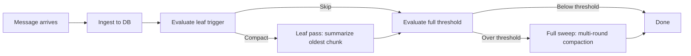
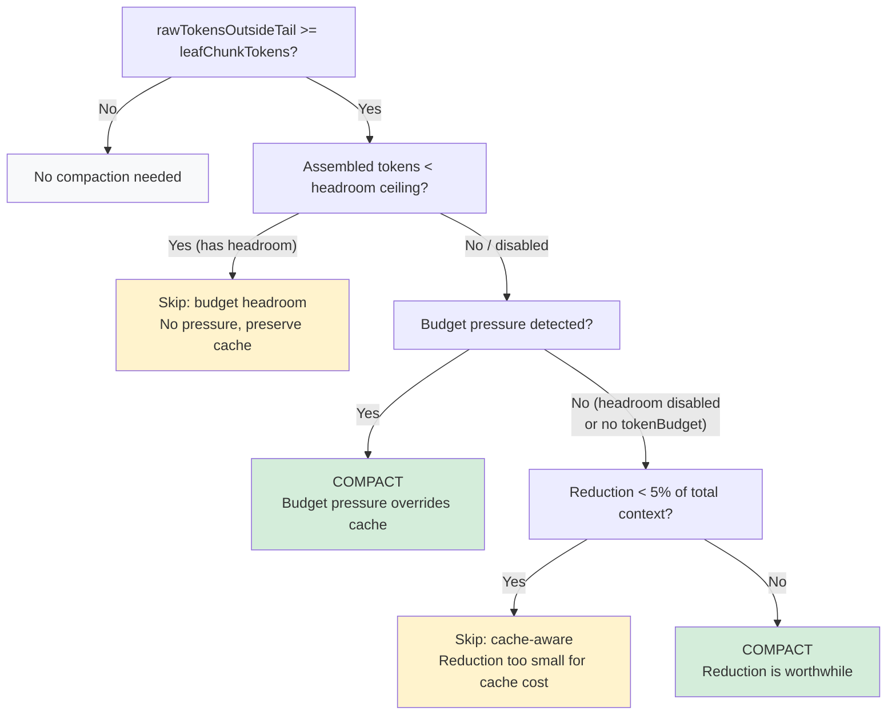

# Compaction Tuning Guide

## TLDR — Quick Setup

Lossless Claw compresses your conversation history into summaries so long sessions don't blow the context window or your API bill. On a 200-turn Opus session, proper tuning can cut input token costs by 40-60%.

> **Example:** A 200-turn Opus coding session costs ~$12 in input tokens without compaction tuning. With the recommended Opus config below and Sonnet as the compaction model, effective cost drops to ~$5.50 (compaction overhead: ~$0.40). **Net savings: ~$6/session.**

**Three things to configure:**

1. **Compaction model** — Use a fast, cheap model. Never use your main model.
2. **Skip thresholds** — Prevent unnecessary compaction that wastes your prompt cache.
3. **Chunk size** — How much context to compress per pass.

### Where to put the config

Add these settings to your plugin config in `openclaw.json` under `plugins.entries.lossless-claw.config`, or set them as environment variables prefixed with `LCM_`:

### Copy-paste configs

**Opus 4.6 (1M context, heavy coding)**
```json
{
  "summaryModel": "claude-sonnet-4-6",
  "summaryProvider": "anthropic",
  "leafChunkTokens": 35000,
  "leafSkipReductionThreshold": 0.02,
  "leafBudgetHeadroomFactor": 0.45
}
```

**Sonnet 4.6 (200K context, general use)** — defaults work well:
```json
{
  "summaryModel": "claude-haiku-4-5",
  "summaryProvider": "anthropic"
}
```

**Haiku 4.5 (quick tasks, 3-10 turns)**
```json
{
  "summaryModel": "claude-haiku-4-5",
  "summaryProvider": "anthropic",
  "leafSkipReductionThreshold": 0.10,
  "leafBudgetHeadroomFactor": 0.90
}
```

**Agent orchestration (main + sub-agents)**
```json
{
  "summaryModel": "claude-sonnet-4-6",
  "summaryProvider": "anthropic",
  "leafChunkTokens": 25000,
  "leafSkipReductionThreshold": 0.02,
  "leafBudgetHeadroomFactor": 0.60
}
```

### Compaction model: the single most important setting

| Do use | Don't use |
|--------|-----------|
| Sonnet 4.6, Haiku 4.5, GPT-4o-mini, Gemini Flash, Mercury | Opus 4.6, o3, any "thinking" model |

**Why:** Compaction runs inline during your session. A slow model (Opus at 3-8s/call) stalls your conversation while it works. A fast model (Haiku at 0.3-0.8s/call) finishes before you notice. Compaction is a straightforward extraction task — expensive models don't produce meaningfully better summaries.

### Verify it's working

After applying the config and restarting, run a session with 10+ turns. Look for `[lcm] afterTurn: leaf compaction triggered` in your logs (stderr). If you see `skipped (budget-headroom: ...)`, the skip guards are active and waiting for budget pressure — this is normal and expected on large-context models.

### Key terms

| Term | Meaning |
|------|---------|
| **Leaf** | A summary created from raw messages (the first compression level) |
| **Condensed** | A summary created from other summaries (higher compression levels) |
| **Fresh tail** | The most recent N messages, always kept raw (never compressed) |
| **Ordinal** | A message's position number in the context sequence |
| **Budget ceiling** | The token threshold where compaction triggers |

---

## How It Works

### The compaction lifecycle

Every conversation turn follows this sequence:



1. **Ingest** — New messages are stored in the database and appended to the context item list.
2. **Leaf trigger** — Checks if raw (unsummarized) messages outside the fresh tail (the most recent protected messages) exceed `leafChunkTokens`. If so, evaluates skip guards before compacting.
3. **Full threshold** — Checks if total assembled context exceeds `contextThreshold x tokenBudget`. If so, runs a multi-round full sweep.
4. **Assembly** — When the model needs context, the assembler builds the prompt from summaries + fresh messages, respecting the token budget.

### The summary hierarchy

Messages are compressed into a layered hierarchy of summaries. Each layer compresses further:

```
Raw messages:
  [msg₁] [msg₂] ... [msg₁₀] [msg₁₁] ... [msg₂₀] [msg₂₁] ... [msg₅₀]

After leaf compaction (depth 0):
  [leaf₁: msgs 1-10] [leaf₂: msgs 11-20] [msg₂₁] ... [msg₅₀]
   ~2400 tokens         ~2400 tokens        ├── fresh tail ──┤

After condensation (depth 1):
  [condensed₁: leafs 1-3] [leaf₄] [leaf₅] [msg₄₁] ... [msg₅₀]
   ~2000 tokens             depth=0          ├── fresh tail ──┤
```

A conversation with 100K raw tokens might be represented as 5K of summaries + 20K of fresh messages — an 80% reduction.

### Why compaction invalidates the prompt cache

When a leaf pass runs, it:
1. Replaces raw messages (positions 0-9) with a single summary (position 0)
2. Resequences all remaining positions to stay contiguous (0, 1, 2, ...)
3. The assembled prompt changes structure — the API prompt cache prefix no longer matches

**Cache miss cost:** On Opus 4.6, a 150K cached prefix costs $1.50/MTok to read. A cache miss on that prefix costs $15/MTok — a **10x penalty**. One unnecessary compaction can cost $2+ in a single cache miss.

### Timing: when compaction runs

```
Turn lifecycle:
  1. [instant]  Ingest message to DB
  2. [instant]  Evaluate leaf trigger (DB reads only)
  3. [0.3-8s]   Leaf compaction (if triggered) — ASYNC, best-effort
  4. [0.3-60s]  Full sweep (if over threshold) — SYNC, blocks session
  5. [instant]  Return to caller
```

**The critical distinction:**
- **Leaf compaction** runs asynchronously (fire-and-forget). It doesn't block the reply.
- **Full sweep** runs synchronously. It blocks the current session until all passes complete. On a large context with a slow compaction model, this can take 30-60 seconds.

This is why compaction model choice matters so much — a slow model turns full sweeps into visible hangs.

---

## Configuration Reference

### Cache-aware skip settings

| Setting | Default | Env Var | Range | Description |
|---------|---------|---------|-------|-------------|
| `leafSkipReductionThreshold` | `0.05` | `LCM_LEAF_SKIP_REDUCTION_THRESHOLD` | 0-1 | Min per-pass reduction as fraction of total assembled tokens. Set to `0` to disable. |
| `leafBudgetHeadroomFactor` | `0.8` | `LCM_LEAF_BUDGET_HEADROOM_FACTOR` | 0-1 | Skip leaf compaction when assembled tokens < factor x contextThreshold x tokenBudget. Set to `0` to disable headroom check (note: also disables budget pressure detection). |

### All compaction settings

| Setting | Default | Env Var | Description |
|---------|---------|---------|-------------|
| `contextThreshold` | `0.75` | `LCM_CONTEXT_THRESHOLD` | Fraction of budget that triggers full-sweep compaction |
| `leafChunkTokens` | `20000` | `LCM_LEAF_CHUNK_TOKENS` | Max raw tokens per leaf pass |
| `leafTargetTokens` | `2400` | `LCM_LEAF_TARGET_TOKENS` | Target output tokens for leaf summaries |
| `condensedTargetTokens` | `2000` | `LCM_CONDENSED_TARGET_TOKENS` | Target output tokens for condensed summaries |
| `freshTailCount` | `64` | `LCM_FRESH_TAIL_COUNT` | Messages protected from compaction |
| `incrementalMaxDepth` | `1` | `LCM_INCREMENTAL_MAX_DEPTH` | Max condensation depth per turn (-1 = unlimited) |
| `leafMinFanout` | `8` | — | Min leaf summaries before condensation |
| `condensedMinFanout` | `4` | — | Min same-depth summaries before condensation |
| `summaryModel` | `""` | `LCM_SUMMARY_MODEL` | Model for compaction (critical — use fast models) |
| `summaryProvider` | `""` | `LCM_SUMMARY_PROVIDER` | Provider for compaction model |
| `summaryTimeoutMs` | `60000` | `LCM_SUMMARY_TIMEOUT_MS` | Timeout per summarization call (ms) |
| `summaryMaxOverageFactor` | `3` | `LCM_SUMMARY_MAX_OVERAGE_FACTOR` | Max allowed summary size as multiple of target (forces truncation above) |
| `circuitBreakerThreshold` | `5` | `LCM_CIRCUIT_BREAKER_THRESHOLD` | Consecutive auth failures before compaction is disabled |
| `circuitBreakerCooldownMs` | `1800000` | `LCM_CIRCUIT_BREAKER_COOLDOWN_MS` | Cooldown before circuit breaker resets (30 min default) |

### Recommended configurations by tier

| Scenario | skipThreshold | headroomFactor | leafChunkTokens | summaryModel | Rationale |
|----------|---------------|----------------|-----------------|--------------|-----------|
| **Opus 1M coding** | 0.02 | 0.45 | 35000 | Sonnet/Haiku | At $15/MTok, compact early. Larger chunks = fewer cache busts. |
| **Sonnet 200K general** | 0.05 | 0.80 | 20000 | Haiku | Defaults work here. Break-even ~13.5 turns. |
| **Haiku quick** | 0.10 | 0.90 | 15000 | Haiku | Short sessions rarely recoup cache invalidation. |
| **Orchestration** | 0.02 | 0.60 | 25000 | Sonnet | Sub-agents accumulate fast. Compact early. |

### Cache economics

| Model | Input $/MTok | Cached $/MTok | Cache miss penalty | Miss on 150K cached |
|-------|-------------|---------------|-------------------|-------------------|
| Opus 4.6 | $15.00 | $1.50 | $13.50/MTok | **$2.03** |
| Sonnet 4.6 | $3.00 | $0.30 | $2.70/MTok | **$0.41** |
| Haiku 4.5 | $0.80 | $0.08 | $0.72/MTok | **$0.11** |

**Break-even formula:** A compaction saving X tokens/turn that invalidates Y cached tokens takes `(Y x miss_penalty) / (X x input_price)` turns to pay back. For typical values (150K cached, 10K saved): **~13.5 turns** regardless of model tier.

### Escape hatches

- `leafSkipReductionThreshold=0` — Disables the cache-aware skip. Compaction fires whenever raw tokens exceed the chunk threshold (original behavior).
- `leafBudgetHeadroomFactor=0` — Disables the headroom check AND budget pressure detection. Only the cache-aware skip remains active.
- Both set to `0` — Fully disables skip guards. Equivalent to pre-feature behavior.

---

## Advanced: Model Selection and Latency

### Why model choice causes session lockups

Compaction calls the LLM to summarize message chunks. Each call:
1. Sends ~20-35K input tokens (the chunk to summarize)
2. Receives ~600-2400 output tokens (the summary)
3. Blocks until complete (full sweep is synchronous)

**Typical latency per compaction call:**

| Model | Latency (20K input) | Cost per call | Session impact |
|-------|-------------------|---------------|----------------|
| Haiku 4.5 | 0.3-0.8s | ~$0.02 | Invisible |
| Sonnet 4.6 | 1-3s | ~$0.10 | Brief pause |
| Gemini Flash | 0.5-1.5s | ~$0.03 | Invisible |
| GPT-4o-mini | 0.5-1.5s | ~$0.02 | Invisible |
| **Opus 4.6** | **3-8s** | **~$0.35** | **Visible stall** |
| **o3 / thinking** | **5-30s** | **$0.50-2.00** | **Session timeout** |

A full sweep on a large context may run 5-15 compaction calls. With Opus, that's 15-120 seconds of stall. With a thinking model, it can exceed the 2-minute typing timeout, causing the agent to appear dead.

### Recommended compaction models

**Always use non-thinking, low-latency models.** Summarization is a straightforward extraction task — expensive models don't produce meaningfully better summaries.

1. `claude-haiku-4-5` — Best cost/latency ratio for Anthropic users
2. `claude-sonnet-4-6` — Slightly better quality, still fast
3. `gpt-4o-mini` — Excellent for OpenAI/OpenRouter users
4. `gemini-2.0-flash` — Good for Google/Vertex users

**Never use for compaction:**
- `claude-opus-4-6` — 5x slower, 5x more expensive, no quality benefit
- Any `o3` / `o1` / thinking model — Chain-of-thought adds 10-30s per call
- `5.4-codex` — Actively corrupts summaries by not following format instructions

### Cache-aware skip guard details

The skip guards evaluate in priority order to balance cache stability against budget pressure:



**Key design principles:**
1. **Budget pressure always wins.** When assembled tokens exceed the headroom ceiling, compaction fires unconditionally — preventing compaction starvation in large contexts.
2. **Cache-aware skip is conservative.** It only fires when there is genuinely no budget pressure and the token savings are negligible relative to total context.
3. **Per-pass estimation.** The reduction estimate uses `min(rawTokensOutsideTail, leafChunkTokens)` — the actual single-pass chunk size, not all raw tokens.

### Sub-agent isolation

When compaction runs on the main agent session, it stalls all connected sessions sharing that thread. To prevent this:

1. **Isolate sub-agent sessions** — Configure `ignoreSessionPatterns` or `statelessSessionPatterns` to prevent sub-agents from triggering compaction
2. **Use shorter timeouts** — Set `summaryTimeoutMs` to 30000 (30s) so failed compaction releases quickly
3. **Choose fast models** — A 0.5s Haiku call is invisible even without isolation

```json
{
  "summaryModel": "claude-haiku-4-5",
  "summaryProvider": "anthropic",
  "summaryTimeoutMs": 30000,
  "ignoreSessionPatterns": ["agent:*:cron:**"],
  "statelessSessionPatterns": ["agent:*:subagent:**"]
}
```

### Debugging compaction issues

**"Compaction never fires"** — Check:
1. Is `leafChunkTokens` set too high? Default is 20K; if your turns are small, raw tokens may never accumulate enough.
2. Is `leafBudgetHeadroomFactor` too high? With a large budget (1M) and default 0.8, the headroom ceiling is 600K — compaction won't fire until then.
3. Enable debug logging to see skip reasons. Look for lines matching `[lcm] afterTurn: leaf compaction skipped` in stderr output.

**"Compaction fires every turn"** — Check:
1. Is `leafChunkTokens` too low? If set to 2000, compaction triggers after just 2-3 messages.
2. Is `leafSkipReductionThreshold` too low or 0? The cache-aware skip might be disabled.
3. Is the context near the budget threshold? Budget pressure overrides all skip guards.

**"Session hangs during compaction"** — Check:
1. What model is used for compaction? Switch to Haiku or a mini model.
2. Is `summaryTimeoutMs` set? Default is 60s — lower it to 30s for faster release.
3. Is the compaction model returning errors? The circuit breaker trips after `circuitBreakerThreshold` (default 5) consecutive auth failures, then cools down for `circuitBreakerCooldownMs` (default 30 min).
