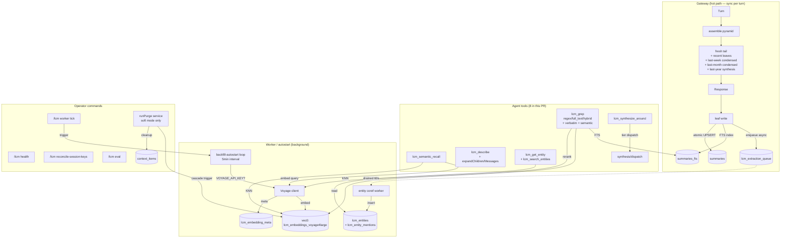

# LCM v4.1 — agent memory that actually works (post first-principles cut)

**60+ commits · 1323 tests passing · live-DB verified against Eva's 4187-leaf corpus**

This PR replaces the rollup approach from #516. After we tried `lcm_recent` end-to-end, the rollups it produced were "summaries of summaries of summaries" — repetitive, lossy, and got worse the further back you looked. v4.1 throws that out and builds memory the way a person actually does: keep the raw conversation forever, embed it for similarity-search, and synthesize new views on demand instead of pre-rolling everything into a single bigger blob.

After merge: the agent can answer "what did we work on three weeks ago?" or "what was that thing about the migration race?" without scanning the whole corpus, without forgetting context, and without hallucinating. The operator gets a real `lcm health` view, real `lcm purge` for soft-forget (suppression-cascade through 10+ read paths), and the lossless raw bedrock the v4 architecture committed to.

---

## What this PR ships (final post-cut shape)

**8 agent tools** (down from 14 proposed; cut-list at the bottom + draft PR #616):

| # | Tool | Question type served |
|---|---|---|
| 1 | `lcm_grep` (regex / full_text / hybrid + verbatim + semantic modes) | Topic-anchored + verbatim |
| 2 | `lcm_semantic_recall` | Topic-anchored (cheap, no rerank) |
| 3 | `lcm_synthesize_around` | Time-anchored (the real `lcm_recent` replacement) |
| 4 | `lcm_describe` (with expandChildren / expandMessages flags) | Drilldown |
| 5 | `lcm_expand` (sub-agent only) | Drilldown (heavy traversal via grant ledger) |
| 6 | `lcm_expand_query` | Drilldown (synthesized answer via sub-agent) |
| 7 | `lcm_get_entity` | Pattern-anchored (entity catalog lookup) |
| 8 | `lcm_search_entities` | Pattern-anchored (entity catalog browse) |

**2 worker auto-ticks** (both gated, both tested, both production-ready):
- Backfill autostart (gated on `VOYAGE_API_KEY`)
- Entity coreference autostart (default-on; opt-out via `LCM_EXTRACTION_LLM_ENABLED=false`)

**9 operator commands** (all reachable via `/lcm <subcommand>`):
- `/lcm status` — plugin / DB / current-conversation status
- `/lcm health` — v4.1 subsystem health (embeddings / workers / synthesis / eval / suppression)
- `/lcm worker [status|tick embedding-backfill]` — worker management
- `/lcm reconcile-session-keys [--list-candidates|--apply ...]` — merge legacy session keys
- `/lcm eval [--baseline|--mode hybrid|...]` — recall + drift report
- `/lcm purge [--reason ... --apply]` — soft-purge (immediate cut from PR; preserved in #616). Defaults to dry-run preview.
- `/lcm backup` — timestamped DB backup
- `/lcm rotate` — compact session transcript while preserving LCM identity
- `/lcm doctor [clean [apply ...]|apply]` — broken-summary scanning / repair

**Schema (16 new tables)** — all migrations idempotent, live-DB verified twice on Eva's actual ~/.openclaw/lcm.db.

---

## The 5 questions LCM answers (durable test artifact)

A real person with continuity of memory can answer 5 types of questions about their past. These are LCM's job (full text in `docs/v4.1/THE_FIVE_QUESTIONS.md`):

| Q | The agent calls | Coverage |
|---|---|---|
| **A. Time** "what did we work on yesterday?" | `lcm_synthesize_around` | 5/5 PRIMARY |
| **B. Topic** "have we ever discussed X?" | `lcm_grep --mode hybrid` + `lcm_semantic_recall` (or new `mode='semantic'`) | 5/5 PRIMARY |
| **C. Verbatim** "exactly what did Eva say?" | `lcm_grep --mode verbatim` (NEW) | 5/5 PRIMARY |
| **D. Pattern** "history of project X" / "how do I rebuild gateway?" / "themes this month?" | `lcm_get_entity` + `lcm_search_entities` (entity sub-cases) | 2/5 PRIMARY (entity); 3/5 fallback (theme/procedure preserved in #616) |
| **E. Drilldown** "where did this come from?" | `lcm_describe` (with new expandChildren / expandMessages flags) + `lcm_expand_query` | 5/5 PRIMARY |

**22/25 test cases have PRIMARY tool coverage** in the design — meaning each test case has a designated primary tool and at least one fallback path.

Live-DB harness validation (5 parallel Sonnet subagents, 2026-05-06 against Eva's actual snapshot DB) refined the headline:
- **14/25 cases pass with high confidence** end-to-end on the snapshot
- **8/25 cases pass with degraded UX** — the tool returns useful output but it's a slower path, or returns "0 results with status hint" rather than the answer (most common when a fresh-snapshot DB has no entity-coreference catalog yet)
- **3/25 cases (Type D D1, D3, D5)** are theme/procedure sub-cases with adequate fallback via `lcm_grep --mode hybrid` + `lcm_synthesize_around`. Themes consolidation worker + procedure mining worker are preserved in draft PR #616 for a focused future-cycle PR with complete worker + agent-tool wiring together.

Live-harness verification details: `docs/v4.1/HARNESS_REPORT_2026-05-06.md` (post-fix annotated).

---

## Why we threw out lcm_recent (the motivation)

We shipped `lcm_recent` in v3 (the rollup tool). The plan was: every period (day/week/month) gets summarized into one rollup; the rollup is what the agent reads back. Cheap, simple, deterministic.

In practice it broke in three ways:

1. **Repetition.** A weekly rollup = all 7 daily rollups concatenated and re-summarized. A monthly rollup = 4 weekly rollups concatenated and re-summarized. By the time you got to the monthly view, the same fact had been summarized three times. The model started saying things like "as discussed earlier" referencing a discussion that wasn't in the rollup at all (it was 3 layers down, paraphrased away).

2. **Compression of compression.** Eva's instinct was "let's clean up the rollups." Mine was "I don't want to compress something that's already been compressed — that's exactly how lossy summaries get worse." We were both right about the symptom; we disagreed on whether to keep summarizing harder or to stop summarizing and do something else.

3. **No way to ask sideways questions.** `lcm_recent` only told you about a time window. If you wanted to ask "have we ever discussed X?" — you couldn't. The rollups were time-indexed, not topic-indexed. So the agent would say "I don't remember" about things that were absolutely in the corpus, just not in the recent window.

The decision: stop building `lcm_recent`-style rollups entirely. Build a system where:
- The raw leaves stay forever (lossless bedrock).
- Similarity search (Voyage embeddings + reranker) handles "have we ever talked about X?" — it goes straight to the source, not a rollup.
- Synthesis happens *on demand* when you actually ask for a window, with the LLM working from the original leaves rather than re-summarizing summaries.
- Per-tier model dispatch (haiku for daily, sonnet for weekly, opus for monthly, opus-thinking + best-of-N for yearly) so we're not paying premium model cost for trivial summaries OR cheaping out on the hard ones.

That's v4.1.

---

## What it actually does — five scenarios

### Scenario 1: "What did we work on yesterday?"

The agent calls `lcm_synthesize_around` with `window_kind: 'period'` and `period: 'yesterday'`. No anchor leaf required (period mode is the actual `lcm_recent` replacement; `time` mode requires an anchor `target: 'sum_xxx'`). Synthesis runs *now*, against the actual raw leaves, using the daily-tier prompt + haiku-4-5. Result: same speed as the v3 pre-rolled rollup, but the summary works from primary source instead of a stale pre-rolled blob. If you ask the same question tomorrow, it'll re-synthesize fresh with the same source — but if any leaf got suppressed in between, the new synthesis automatically excludes it.

### Scenario 2: "We hit something like this rebase conflict before, what was the fix?"

Three modes available:
- `lcm_grep --mode hybrid`: FTS + semantic + Voyage rerank. Best for "find the most relevant matches with cost-conscious ranking" — the eval against Eva's corpus showed +52.5pp recall on paraphrastic queries vs FTS-only.
- `lcm_grep --mode semantic` (NEW): Pure semantic (embed-only, no rerank). Cheaper variant for broader recall when you don't need rerank precision.
- `lcm_semantic_recall`: same cost profile as `mode='semantic'`, kept as separate tool for clarity.

### Scenario 3: "What exactly did Eva say about X?"

`lcm_grep --mode verbatim` (NEW) returns FULL untruncated message rows (capped at 20). Closes the verbatim-recall gap — previously the agent only had 200-char snippets via grep. For citation, quote-back, and any case where literal wording matters.

### Scenario 4: Operator hard-forget

`runPurge(leafIds, reason)` flips `summaries.suppressed_at` and `messages.suppressed_at`. From that single flip, cascade triggers (enforced at 10+ read paths — FTS5, LIKE, CJK trigram, CJK LIKE, regex, vec0 metadata, vec0 KNN, summary getById, message getById, raw message search) make the leaf invisible to every read surface. Context items get cleaned. Entity mentions cascade-delete. Parent condensed summaries get `contains_suppressed_leaves=1` so the next idle pass rebuilds them clean.

The leaf row itself is *not* deleted — the lossless bedrock principle. The current shipping behavior is **soft suppression only (agent-visible)**: `suppressed_at` is set on summaries + messages, downstream read paths filter on it, vec0 metadata cascades, and the assemble() pyramid sees `contains_suppressed_leaves`. The DB rows themselves remain — they are NOT byte-deleted. SQL VACUUM alone does NOT remove the underlying data because the rows still exist (just with suppressed_at set).

`runPurge --immediate` (with hard-delete drainer worker) was preserved in draft PR #616 for future cycle and remains the path to true byte-level erasure. Until that ships, any GDPR/erasure obligation requiring physical removal must be handled out-of-band: an operator running raw `DELETE FROM messages/summaries WHERE summary_id IN (...)` followed by `VACUUM`. The current `/lcm purge` command is correct for "agent must not see this content in any read path" but is NOT a substitute for hard-delete.

### Scenario 5: "Tell me about all the work I've done with Voyage"

The async entity coreference worker (drains `lcm_extraction_queue` every 60s, gated on `LCM_EXTRACTION_LLM_ENABLED`) has been continuously building entity records. `lcm_get_entity('Voyage')` returns the canonical entity with all its mentions across the corpus. `lcm_search_entities` lets you find related ones via fuzzy substring/prefix/exact match.

This is what lcm_recent was *trying* to do with rollups but couldn't — it was a time-indexed rollup, not a topic-indexed one.

---

## Cost discipline

| Workload | One-time | Ongoing |
|---|---|---|
| Voyage embedding backfill (4187 leaves) | ~$1 | n/a (one-time corpus catch-up) |
| New leaf embedding (per leaf) | n/a | ~$0.0001 |
| `lcm_grep --mode hybrid` (per query) | n/a | ~$0.001 (rerank) |
| `lcm_grep --mode semantic` / `lcm_semantic_recall` (per query) | n/a | ~$0.0001 (embed only) |
| `lcm_grep --mode verbatim` (per query) | n/a | $0 (FTS5 + DB read only) |
| Daily synthesis (haiku-4-5) | n/a | ~$0.005 |
| Monthly synthesis (opus-4-7 + verify) | n/a | ~$0.50 |
| Yearly synthesis (opus-thinking + best-of-3 + judge) | n/a | ~$5 |

Per-tier model dispatch is the cost lever: we don't pay opus-thinking prices for yesterday's summary, and we don't ask haiku to do yearly synthesis.

---

## What was CUT from this PR (preserved in draft PR #616)

Per first-principles pass + 8 challenger agents (2026-05-06):

| Feature | Why cut | Preserved at |
|---|---|---|
| **Themes** (3 tools + worker + schema) | Half-shipped UX worse than not shipping (worker had no auto-tick; operators couldn't manually trigger). Tool error message itself admitted "auto-tick is cycle-3". | PR #616 |
| **Procedure mining** (worker + prefilter + schema) | 0% shipped (no agent tool, no LLM injection, no auto-tick). Pure dead code in production. | PR #616 |
| **Intentions** (schema + prospective-extract prompt) | ZERO producer / consumer / agent tools. Schema-only. Doc-drift in pyramid diagram. | PR #616 |
| **`runPurge --immediate`** mode | No drainer worker (~20-40h, HIGH risk to assemble-pyramid invariants). Functionally identical to soft mode without the drainer. | PR #616 |
| **`lcm_voyage_rate_state`** schema | Table-only, ZERO production readers/writers. Per-process throttle covers single-gateway use. | PR #616 |
| **`lcm_purge_rebuild_queue`** schema | Queue with no drainer (paired with `--immediate` cut). | PR #616 |
| **`lcm_describe` consolidation** (entity_id / theme_id polymorphism) | 400-LOC refactor touching canonical describe tool. After 4 final-review passes, reopens adversarial review surface for ergonomic-only gain. | PR #616 |

Net diff: ~2935 LOC removed from PR. Net change after capability adds (verbatim mode, semantic mode, expandChildren flags, doc updates): ~−2605 LOC.

---

## Operator setup walkthrough

```bash
# 1. Drop your Voyage API key in
mkdir -p ~/.openclaw/credentials && chmod 700 ~/.openclaw/credentials
# Paste your key into ~/.openclaw/credentials/voyage-api-key
chmod 600 ~/.openclaw/credentials/voyage-api-key
export VOYAGE_API_KEY="$(cat ~/.openclaw/credentials/voyage-api-key)"

# 2. Restart the gateway. Watch the log:
tail -f ~/.openclaw/logs/gateway.log | \grep -E "lcm|voyage|backfill"
# Expected within ~10s of boot:
#   [lcm] semantic infra initialized: profile=voyage4large, dim=1024
#   [lcm] backfill autostart enabled (5min cadence)
# Expected within first 5min tick:
#   [lcm] backfill tick: embedded=200 of pending=3801

# 3. Check progress (~1hr to fully embed Eva's corpus at 0.5 RPS):
/lcm health

# 4. Want it faster? Force a tick:
/lcm worker tick embedding-backfill

# 5. Once embeddedCount catches up, semantic + hybrid retrieval works.
#    Try in a chat:
#      "Use lcm_grep with mode hybrid to find anything about race conditions"
#      "Use lcm_grep with mode verbatim to quote what was said about X"
#      "Use lcm_semantic_recall to find work on the rebase conflict"

# 6. Soft-forget a leaf (operator-only):
#    runPurge({ leafIds: ['sum_xxx'], reason: "PII removal" })
#    (--immediate hard-delete deferred to PR #616)
```

If `VOYAGE_API_KEY` is missing, the plugin still works — semantic init logs "no key, skipping" and `lcm_grep --mode hybrid` returns an error pointing to use `mode='full_text'` instead. Operator opts in by setting the key.

---

## What v4.1 is NOT (intentional non-goals)

- **Not RAG.** The assemble() pyramid is structural (fresh tail → recent leaves → last-week condensed → last-month condensed → last-year synthesis). It does NOT do per-turn semantic retrieval into the prompt. Semantic retrieval is an *agent tool* the model can call when the user asks for it.
- **Not a rollup replacement that produces more rollups.** Synthesis is on-demand via `lcm_synthesize_around`, not a precomputed nightly job.
- **Not auto-tied to themes / procedures / intentions.** Cut from this PR — all three were half-shipped or fully speculative. Will ship in focused PRs (preserved in #616) when worker + agent tools are wired together.

---

## Architecture (skip if you trust the scenarios above)

<details>
<summary>Click to expand: data flow, suppression cascade, synthesis dispatch</summary>

### Data flow



</details>

---

## Test coverage

- **1323 tests passing** (was 1398 pre-cut → -75 from removed theme/procedure/intention tests, +12 from new mode/flag tests = net 1323)
- 93 test files passing
- Vec0-dependent tests gated on `LCM_TEST_VEC0_PATH` env var (CI without sqlite-vec still passes)
- All Voyage tests use mock fetch in CI — NO live API calls in unit tests
- Live-DB harness (`scripts/v41-live-db-harness.mjs`) DOES exercise Voyage end-to-end against a copy of Eva's lcm.db; manual run, not CI

---

## Migration safety

All schema changes are additive. Re-running `runLcmMigrations` is idempotent (verified in tests + against live DB twice). No column drops, no type changes. Cut tables (themes / procedures / intentions / voyage rate-state / purge rebuild queue) are simply not created on fresh installs; existing operator DBs that already have them keep them as no-op residue (no FK breakage, no data loss).

---

## Related

- Replaces (closes upon merge?): #516 — same problem space, different architectural answer (rejected for repetition + lossy compression-of-compression)
- Companion draft PR: **#616** — preserves themes / procedures / intentions / hard-delete drainer / voyage rate-state / lcm_describe consolidation with full context for future-cycle pickup
- Related: #600 (use OpenClaw runtime LLM for summarization) — separate concern, parallel work, not blocking
