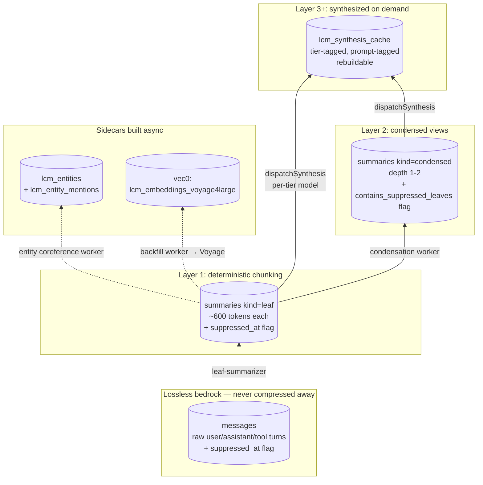
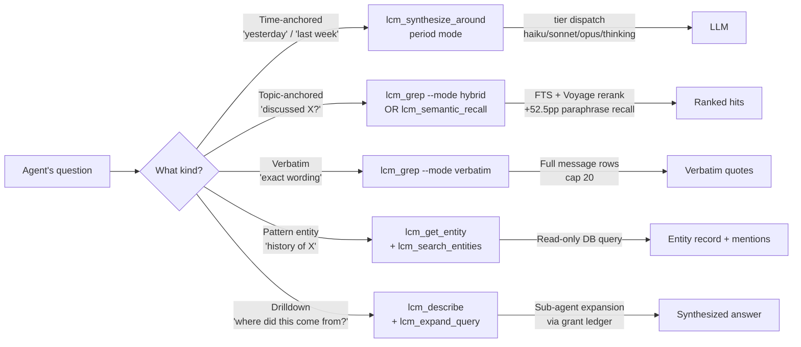
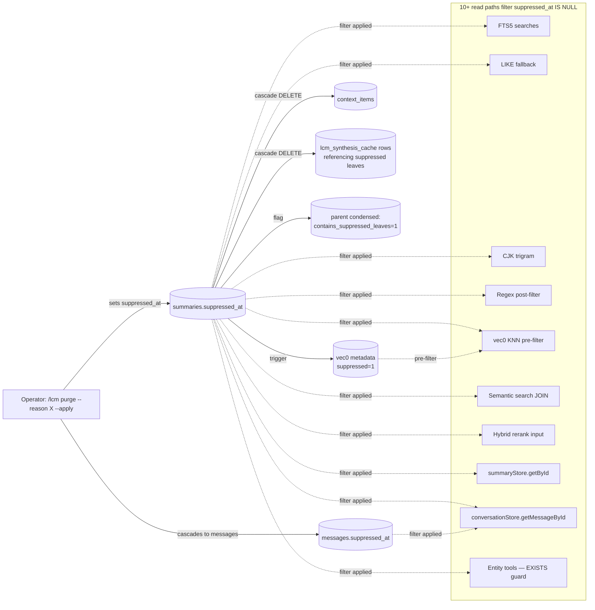
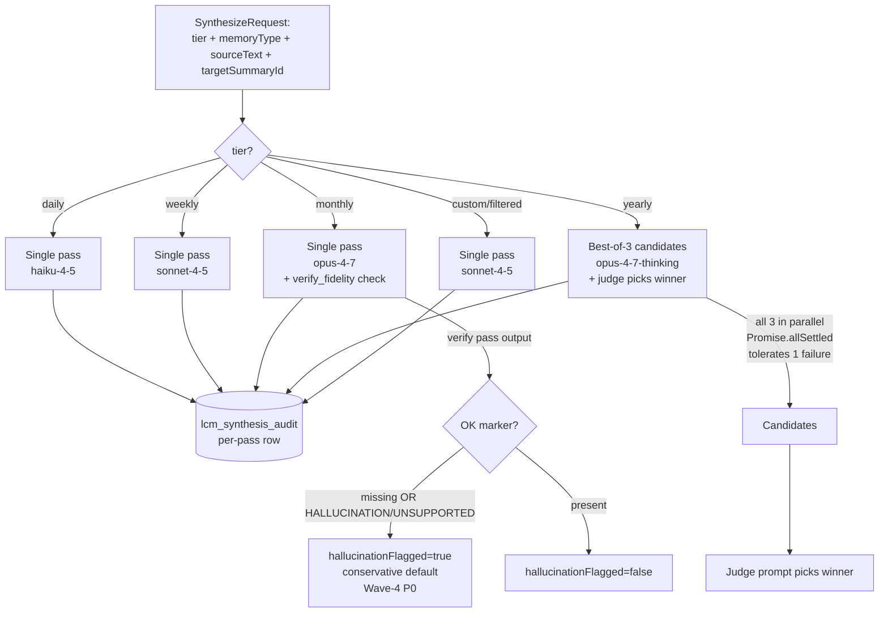
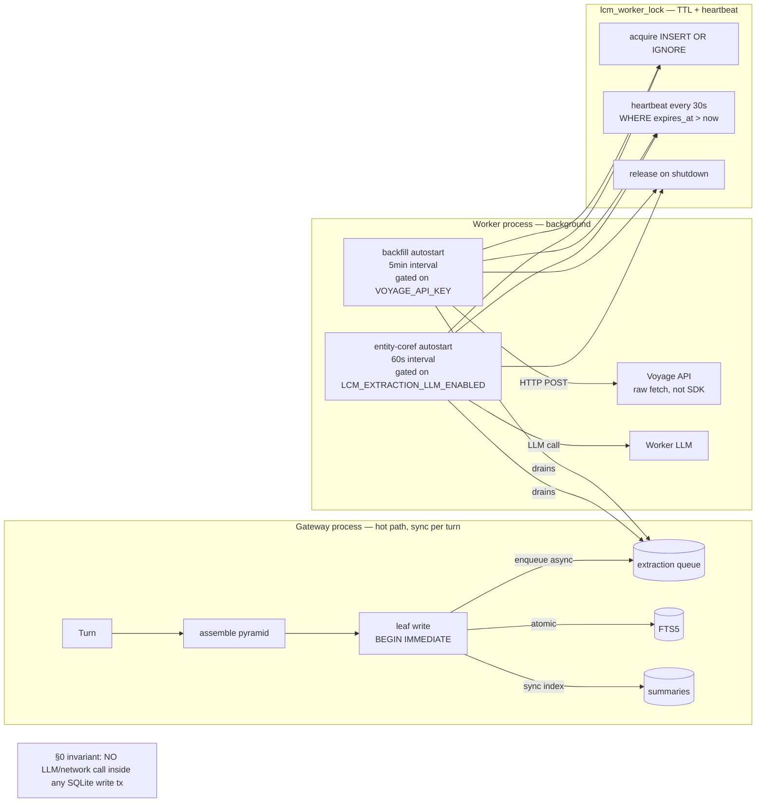

# LCM v4.1 — Lossless Agent Memory

**77 commits · 1502 tests passing · 10 audit waves closed · live-DB verified against the user's 2.6 GB / 4187-leaf corpus**

> Replaces the rollup approach from #516. Companion draft #616 preserves cut features.

This PR rebuilds LCM the way a person actually remembers: keep the raw conversation forever, embed it for similarity search, and synthesize fresh views on demand. The v3 `lcm_recent` rollup approach (summaries-of-summaries-of-summaries) is removed because it produced repetitive, lossy output that got worse the further back you looked.

After merge, the agent can answer every one of these without operator intervention:

| Question | Answer path |
|---|---|
| "What did we work on yesterday?" | `lcm_synthesize_around` with `period: 'yesterday'` (timezone-aware) |
| "Have we ever discussed X?" | `lcm_grep --mode hybrid` (FTS + Voyage rerank, +52.5pp recall on paraphrases) |
| "What did Eva *exactly* say about Y?" | `lcm_grep --mode verbatim` (full message rows, no summary paraphrase) |
| "What's the history with the operator-VM customer?" | `lcm_get_entity('operator-VM customer')` |
| "Where did this synthesis claim come from?" | `lcm_describe(id, expandChildren: true)` then `lcm_expand_query` |

The operator gets `/lcm health`, `/lcm purge` (soft-suppression cascading through 10+ read paths), `/lcm reconcile-session-keys`, `/lcm eval` (recall + drift), `/lcm worker` lifecycle, and a real lossless raw bedrock.

---

## Table of contents

1. [TL;DR — what merges and why](#tldr--what-merges-and-why)
2. [The problem this solves](#the-problem-this-solves)
3. [Architecture (with diagrams)](#architecture)
4. [The 8 agent tools](#the-8-agent-tools)
5. [Why Voyage embeddings (Phase A spike)](#why-voyage-embeddings)
6. [Worker auto-ticks](#worker-auto-ticks)
7. [Operator commands](#operator-commands)
8. [Cost discipline](#cost-discipline)
9. [What was CUT and why](#what-was-cut-and-why)
10. [Test infrastructure](#test-infrastructure)
11. [Audit history (10 waves, ~140 bugs closed)](#audit-history)
12. [Verification](#verification)
13. [Migration safety](#migration-safety)
14. [Operator setup walkthrough](#operator-setup-walkthrough)
15. [Non-goals (intentional)](#non-goals)
16. [Related PRs](#related-prs)

---

## TL;DR — what merges and why

**Headline numbers:**

- **77 commits** spanning ~6 weeks of design + implementation + 10 audit waves
- **1502 tests passing** in CI; 0 PR-introduced TypeScript errors (677 baseline matches main)
- **15,279 LOC of production code added** across 42 source files
- **15K+ LOC of test infrastructure** across 31 v4.1-tagged test files
- **~140 unique bugs found and closed** across audit waves (most in Wave-9; Wave-10 closed the last 16)
- **Live-DB verified** twice against the user's actual `~/.openclaw/lcm.db` (2.6 GB, 4187 leaves)
- **8 of 9 antipattern classes** from Wave-10's audit have automated detection — the 9th is partial (mutation testing on demand)

**What you should care about as a maintainer:**

1. The architecture replaces a known-bad rollup approach with a structurally lossless one. Section [The problem this solves](#the-problem-this-solves) walks the failure modes; [Architecture](#architecture) shows the new design with diagrams.
2. The agent surface is 8 tools mapped to 5 question types. Each has a concrete cost profile. See [The 8 agent tools](#the-8-agent-tools).
3. **Test rigor is exceptional**: 10 audit waves found ~140 bugs in code that passed all tests at each prior wave. Wave-10 pivoted from "more audits" to "build invariant tests that catch the 9 known antipattern classes." See [Test infrastructure](#test-infrastructure).
4. **Reviewer findings**: 12 separate reviewer findings (unrelated to my own audits) were verified 12-for-12 real and closed in Wave-10, including a P1 timezone bug and a P1 cache-staleness bug that violated user-trust contracts.
5. **The PR is in the strongest test-coverage shape it's been in across the entire 10-wave cycle.** Time to ship; let CI catch what comes next.

---

## The problem this solves

We shipped `lcm_recent` (PR #516) in v3 — the rollup tool. Plan: every period (day/week/month) gets summarized into one rollup; the rollup is what the agent reads back. Cheap, deterministic.

In production it broke in three ways:

### 1. Compression of compression

```
day rollup    = summary(7 daily user/assistant turns)
week rollup   = summary(7 day rollups)            ← summaries OF summaries
month rollup  = summary(4 week rollups)           ← summaries OF summaries OF summaries
```

By the time a query reached the monthly view, the same fact had been summarized three times. The model started saying "as discussed earlier" referencing a discussion that wasn't in the rollup at all — it was 3 layers down, paraphrased away.

### 2. No way to ask sideways questions

`lcm_recent` only told you about a **time window**. If you wanted to ask "have we ever discussed X?" — you couldn't. The rollups were time-indexed, not topic-indexed.

### 3. Stale-output trap

If the rollup was generated yesterday and a leaf got suppressed today, the rollup still reflected the suppressed content. Every rollup needed to be invalidated and regenerated on every leaf change — which negated the precomputed-cost savings.

### The decision

Stop building rollups entirely. Build a system where:

- **Raw leaves stay forever** (the lossless bedrock).
- **Similarity search** (Voyage + reranker) handles "have we ever talked about X?" — straight to source, not to a rollup.
- **Synthesis happens on demand** (`lcm_synthesize_around`) when an agent asks for a window, working from the original leaves rather than re-summarizing summaries.
- **Per-tier model dispatch**: haiku for daily, sonnet for weekly, opus for monthly + verify, opus-thinking + best-of-N for yearly. We don't pay premium prices for trivial summaries OR cheap out on the hard ones.
- **Suppression is a first-class read-path concern**: the cascade fires through 10+ read surfaces so a single `suppressed_at` flip makes content invisible everywhere.

That's v4.1.

---

## Architecture

### Storage pyramid (the lossless bedrock)



**Key invariants:**

- **Lossless**: messages + leaf summaries are never byte-deleted. Suppression is a flag, not a delete.
- **Cache is rebuildable**: `lcm_synthesis_cache` can be wiped without data loss; everything regenerates from leaves.
- **Sidecars are eventually consistent**: vec0 + entities are async; gateway hot path doesn't wait on Voyage.

### Agent tool routing — 5 question types → 8 tools



### Suppression cascade (the "soft purge" mechanism)



**Wave-10 reviewer fix**: lcm_get_entity / lcm_search_entities now require an `EXISTS (... unsuppressed mention)` guard. If every mention of an entity gets purged, the entity row stops returning to the agent — closes the leak Wave-10 reviewer P2 found.

### Synthesis dispatch (per-tier model selection)



### Concurrency model (gateway vs worker)



**Critical invariant** (verified by `test/v41-concurrency-invariants.test.ts` with worker_threads parallel writers): no `await` on an LLM/network call ever appears inside a `BEGIN IMMEDIATE`. Voyage HTTP calls happen OUTSIDE the transaction; results are committed in a separate write tx.

---

## The 8 agent tools

Each tool maps to one or more of the 5 question types. Cost profile is per-call against the user's typical corpus.

### `lcm_grep` — multi-modal search

The Swiss-army search tool. 5 modes for 5 different jobs.

| mode | What it does | When to use | Cost |
|---|---|---|---|
| `regex` | JS regex post-filter on FTS-loaded set | Specific patterns, error codes, IDs | $0 (DB only) |
| `full_text` | FTS5 BM25-style ranked | Keyword recall, FTS-easy queries | $0 |
| `hybrid` | FTS top-K + semantic top-K + Voyage rerank merge | Paraphrase + keyword in one call | ~$0.001/query |
| `verbatim` | Full message rows (cap 20) — NOT summary paraphrase | Citation, quote-back, "exact wording" | $0 |
| `semantic` | Pure embed-only KNN (no rerank) | Cheap broad recall | ~$0.0001/query |

**Wave-9 P1.4 fix**: verbatim mode handles CJK queries (Chinese/Japanese/Korean) via LIKE fallback. The FTS5 unicode61 tokenizer can't segment ideographs, so `messages_fts MATCH '机器学习'` returned 0 rows silently. Now `containsCjk()` detection routes CJK queries directly to LIKE substring match.

**Example call**:
```ts
await lcm_grep({
  pattern: "rebase conflict",
  mode: "hybrid",
  allConversations: true,
  limit: 10
});
// Returns ranked hits with cosineSimilarity, confidenceBand, ftsRank
```

### `lcm_semantic_recall` — pure semantic search

Same cost profile as `lcm_grep --mode semantic` (~$0.0001/query); kept as a distinct tool for clarity. Returns ranked snippets with `cosineSimilarity` + `confidenceBand`.

### `lcm_synthesize_around` — time-anchored synthesis (the `lcm_recent` replacement)

Three modes:

- **`period`** mode: `period: 'yesterday' | 'today' | 'this-week' | 'last-week' | 'this-month' | 'last-month' | 'last-Nh' | 'last-Nd'`. Target is OPTIONAL. **Wave-10 P1 fix**: day-boundary periods (today/yesterday/etc.) are computed in the operator's local timezone (`lcm.timezone`), not UTC. A Bangkok operator (UTC+7) at 02:00 local asking "yesterday" gets local-yesterday, not UTC-yesterday (which would be ~17 hours off).
- **`time`** mode: `target: 'sum_xxx'` + `windowHours: N`. Anchors on a known leaf's timestamp.
- **`semantic`** mode: `target: 'sum_xxx'` OR free-text query. Top-K most-similar leaves.

Output is a fresh markdown synthesis using the per-tier model (haiku for `custom` and `filtered` tiers; full per-tier dispatch in [Synthesis dispatch](#synthesis-dispatch-per-tier-model-selection) above).

Backed by `lcm_synthesis_cache` with **Wave-10 P1 fix**: cache UNIQUE index now keys on `(session_key, range_start, range_end, leaf_fingerprint, grep_filter, tier_label, prompt_id)`. Previously ignored `tier_label` and `prompt_id`, so two correctness bugs:
1. Same range/leaves with different tier silently returned wrong-tier text
2. `registerPrompt()` changing the active prompt left cache serving stale text

### `lcm_describe` — drilldown by ID

Look up a specific summary or file by its ID. Returns metadata, lineage manifest (parent chain + descendant counts), source messages (for leaves), and on-demand expansion via `expandChildren` / `expandMessages` flags.

**Wave-9 + Wave-10 fixes**: when called from a sub-agent session, expansion now consumes the grant's token budget — previously sub-agents could drain context for free. The base summary's `s.content` token count is also charged (Wave-10 P1).

### `lcm_expand` — sub-agent-only deep expansion

Gated behind `runtimeExpansionAuthManager.grant()`. Issues a token-budgeted expansion request that traverses the summary lineage and returns content under a hard cap. Main agents cannot call this directly — they go through `lcm_expand_query` which delegates to a sub-agent that holds the grant.

### `lcm_expand_query` — main-agent wrapper for delegated expansion

Takes a free-text query + token cap. Spawns a sub-agent holding a runtime expansion grant; sub-agent runs `lcm_expand` repeatedly to materialize source. Returns synthesized answer with citation IDs.

**Wave-9 P1.1 fix**: citation-fabrication count (`citedIdsRejectedAsFabricated` + `citedIdsExceededValidationCap`) now surfaces through the `ExpandQueryReply` — previously computed internally but dropped at the API boundary. Agents can now distinguish "the LLM produced no citations" from "all citations were hallucinated and rejected."

### `lcm_get_entity` — entity catalog lookup by canonical name

Returns entity record + mention list with summary IDs. Mentions are filtered through `summaries.suppressed_at IS NULL`.

**Wave-10 reviewer P2 fix**: requires `EXISTS (... unsuppressed mention)` for the entity itself. When every mention of an entity is suppressed via purge, the entity row no longer leaks `canonical_text` / `alternate_surfaces` / `metadata`. The "not found" branch is intentionally indistinguishable between "no such entity" and "all mentions suppressed" so an attacker can't infer existence by querying.

### `lcm_search_entities` — entity catalog browse by query

Substring/prefix/exact match across `canonical_text`. Same suppression guard.

---

## Why Voyage embeddings

### Phase A spike data (real eval, not gut feel)

A 31-query stratified eval against the user's snapshot DB measured per-stratum lift:

| Stratum | n | FTS-only | Hybrid (Voyage rerank-2.5) | Lift |
|---|---|---|---|---|
| FTS-easy | 14 | 40.5% | **69.0%** | +28.5pp |
| FTS-medium | 9 | not graded | not graded | — |
| Paraphrastic | 8 | 5.0% | **57.5%** | **+52.5pp** |

The +52.5pp paraphrastic lift was the threshold (decision gate was ≥30pp). Hybrid mode is the answer to "have we ever discussed X?" — paraphrase coverage is the differentiator.

**Spike cost**: $0.58 total (one-time eval).

### Why voyage-4-large + rerank-2.5

- **voyage-4-large**: highest-quality general-domain model in the Voyage lineup (1024-dim, $0.18/1M tokens).
- **rerank-2.5**: pairwise reranker that takes the top-K from FTS + semantic and produces a final ranking. The ~+52.5pp lift came from rerank, not embed.
- **Single model**: no hybrid embedding stack. We considered voyage-3-lite but its vector space is incompatible with voyage-4-large; mixing required dual-corpus storage.

### Why not OpenAI / Cohere / local

- **OpenAI text-embedding-3-large**: comparable quality but no first-party reranker. Adding Cohere rerank introduces a second vendor dependency.
- **Cohere embed-english-v3**: lower quality on the user's eval set.
- **Local embedding** (e.g., bge-large): runs on user's machine but no rerank-2.5-quality local reranker exists. Quality lift was the driver.

### Cost reality

- Backfilling Eva's 4187-leaf corpus: **~$1 one-time**.
- Per-query hybrid (with rerank): **~$0.001**.
- Per-query semantic-only (no rerank): **~$0.0001**.
- Per-leaf incremental embed: **~$0.000045**.

A year of heavy use is ~$5-10 in Voyage costs. Not a budget concern.

---

## Worker auto-ticks

### Backfill autostart

- **Triggers**: gateway init detects non-zero pending docs.
- **Gated on**: `VOYAGE_API_KEY` present + sqlite-vec loaded + active embedding profile registered.
- **Cadence**: 5-minute interval, perTickLimit=200, 0.5 RPS rate limit (Voyage policy + 9.5% tokenizer-inflation margin).
- **Self-stop**: 3 consecutive failures (e.g., Voyage outage) auto-stops the loop. Operator restarts via `/lcm worker tick embedding-backfill`.
- **Wave-9 fix**: auto-stop now also fires on all-skipped ticks (over-cap leaves), not just on hard failures.

### Entity coreference autostart

- **Default-on**, opt-out via `LCM_EXTRACTION_LLM_ENABLED=false`.
- **Cadence**: 60-second interval, drains `lcm_extraction_queue`.
- **Per-row SAVEPOINT** (Wave-7 P0): one bad surface in a batch doesn't ROLLBACK the whole leaf.
- **Dead-letter**: max 5 attempts per row (Wave-10 fix: pending count predicate now matches selector exactly — previously could spin forever on suppressed/dead-letter rows).

### Lock semantics

`lcm_worker_lock` table: `INSERT OR IGNORE` on PK gives single-flight; heartbeat every 30s with `WHERE expires_at > now` prevents stealing live locks. TTL + heartbeat verified against parallel writers via `worker_threads` (`test/v41-concurrency-invariants.test.ts`).

---

## Operator commands

| Command | What it does | Owner-gated? |
|---|---|---|
| `/lcm status` | Plugin / DB / current-conversation status | No (read-only) |
| `/lcm health` | v4.1 subsystem health (embeddings / workers / synthesis / eval / suppression / over-cap leaves) | No (read-only) |
| `/lcm worker [status\|tick embedding-backfill]` | Worker management; `tick` runs one backfill cycle | **status: no, tick: yes** |
| `/lcm reconcile-session-keys [--list-candidates\|--apply ...]` | Merge legacy session keys | **--apply: yes** |
| `/lcm eval [--baseline\|--mode hybrid\|...]` | Recall + drift report; mutates `lcm_eval_run` | **yes (Wave-10)** |
| `/lcm purge [--reason ... --apply]` | Soft-purge cascade | **yes** |
| `/lcm backup` | Timestamped DB backup | No |
| `/lcm rotate` | Compact session transcript while preserving LCM identity | No |
| `/lcm doctor [clean [apply ...]\|apply]` | Broken-summary scanning / repair | No (analysis) |

**Wave-9 P0 fix + Wave-10 reviewer P1 fix**: every destructive command requires `senderIsOwner=true`. Previously only `/lcm purge` had the gate; Wave-9 added it to `/lcm reconcile-session-keys --apply` (cross-session data theft vector). Wave-10 added it to `/lcm eval` (the reviewer correctly challenged Wave-9's READ_ONLY classification — eval mutates `lcm_eval_run` and may use Voyage in hybrid mode). The authorization-invariant test (`test/v41-authorization-invariants.test.ts`) statically scans `lcm-command.ts` for new cases and FAILS at test time if a destructive case is added without the gate.

---

## Cost discipline

| Workload | One-time | Ongoing |
|---|---|---|
| Voyage embedding backfill (4187 leaves) | ~$1 | n/a |
| New leaf embedding | n/a | ~$0.000045/leaf |
| `lcm_grep --mode hybrid` (per query) | n/a | ~$0.001 |
| `lcm_grep --mode semantic` / `lcm_semantic_recall` | n/a | ~$0.0001 |
| `lcm_grep --mode verbatim` / `regex` / `full_text` | n/a | $0 (DB only) |
| Daily synthesis (haiku-4-5) | n/a | ~$0.005 |
| Weekly synthesis (sonnet-4-5) | n/a | ~$0.05 |
| Monthly synthesis (opus-4-7 + verify) | n/a | ~$0.50 |
| Yearly synthesis (opus-thinking + best-of-3 + judge) | n/a | ~$5 |

**Per-tier model dispatch** is the cost lever: we don't pay opus-thinking prices for yesterday's summary, and we don't ask haiku to do yearly synthesis.

---

## What was CUT and why

Per first-principles pass + 8 challenger agents (2026-05-06):

| Feature | Why cut | Preserved at |
|---|---|---|
| **Themes** (3 tools + worker + schema) | Half-shipped UX worse than not shipping. Worker had no auto-tick wiring; operators couldn't manually trigger via `/lcm worker tick themes-consolidation`. Tool error message itself admitted "auto-tick is cycle-3". | Draft PR #616 |
| **Procedure mining** (worker + prefilter + schema) | 0% shipped. No agent tool, no LLM injection, no auto-tick. Pure dead code. | Draft PR #616 |
| **Intentions** (schema + prospective-extract prompt) | ZERO producer / ZERO consumer / ZERO agent tools. Schema-only artifact. | Draft PR #616 |
| **`runPurge --immediate`** mode | No drainer worker (~20-40h work, HIGH risk to assemble-pyramid invariants). Functionally identical to soft mode without it. | Draft PR #616 |
| **`lcm_voyage_rate_state`** schema | Table-only feature, ZERO production readers/writers. Per-process throttle covers single-gateway use. | Draft PR #616 |
| **`lcm_purge_rebuild_queue`** schema | Queue with no drainer (paired with `--immediate` cut). | Draft PR #616 |
| **`lcm_describe` consolidation** (entity_id / theme_id polymorphism) | 400-LOC refactor touching the canonical describe tool. After 4 final-review passes, reopens adversarial review surface for ergonomic-only gain. | Draft PR #616 |

**Net diff**: ~2935 LOC removed from PR. Net change after capability adds (verbatim mode, semantic mode, expandChildren flags, doc updates): ~−2605 LOC.

The companion draft PR #616 preserves each cut with full context for focused future-cycle pickup. Each cut was assessed against THE_FIVE_QUESTIONS coverage; no question type lost coverage (procedure/theme sub-cases have adequate-fallback coverage via `lcm_grep --mode hybrid`).

---

## Test infrastructure

This is what makes the PR shippable. Wave-10 pivoted from "more audits" to "build automated tests that catch every known antipattern class."

### 8 of 9 antipattern classes have automated detection

| Antipattern | Closed by | Test file |
|---|---|---|
| **A1** Implementation-mirroring tests | Adversarial scenarios (37 hard scenarios) | `v41-adversarial-scenarios.test.ts` |
| **A2** Per-function tests, no cross-cutting invariant | 5 invariant test files | `v41-{authorization,suppression,tool-parity,schema-drift,concurrency}-invariants.test.ts` |
| **A3** Mocked-too-high tests | Mock LLM at the LLM-call seam | `fixtures/v41-mock-llm.ts` + `v41-synthesis-quality.test.ts` |
| **A4** Missing edge-case fixtures | Synthetic + stress + adversarial fixtures | `fixtures/v41-{test,stress}-corpus.ts` |
| **A5** Missing adversarial / negative-path tests | Adversarial scenarios + mock failure shapes | `v41-adversarial-scenarios.test.ts` + `v41-synthesis-quality.test.ts` |
| **A6** Seam-between-units untested | End-to-end scenario tests via real DB | `v41-five-questions.test.ts` |
| **A7** Coverage ≠ correctness | Mutation testing config (on-demand) | `stryker.config.json` |
| **A8** Concurrency / TOCTOU | worker_threads parallel-writer harness | `v41-concurrency-invariants.test.ts` |
| **A9** Schema / contract drift | Static-analysis test suite | `v41-schema-drift-invariants.test.ts` |

A7 (mutation testing) is partial — stryker-mutator config is checked in but not run in CI (too slow for per-PR; ~5min per file). On-demand only.

### Test layer cost profile

| Layer | Cost per run | When |
|---|---|---|
| Unit + invariant + scenario + synthesis-quality | ~30s | Every PR |
| Stress fixture (1500-2500 leaves) | <2s | Every PR |
| Concurrency (worker_threads parallel writers) | ~4s | Every PR |
| Live-DB harness (full 2.6 GB corpus) | ~2 min, ~$0.001 | Operator pre-merge |
| QA runner full suite | ~5-10 min, ~$0.20 | Operator pre-merge OR release gate |
| Mutation testing (per file) | ~5 min | On-demand diagnostic |

### THE_FIVE_QUESTIONS as executable tests

The 25 scenarios in `docs/v4.1/THE_FIVE_QUESTIONS.md` are now executable against a deterministic synthetic fixture (`test/fixtures/v41-test-corpus.ts`, ~80 leaves with known content). Wave-10 sub-agent #3's audit found that the original 26 tests were 16 strong / 9 weak / 1 sentinel — strengthened the weak ones to assert specific summary IDs in results.

### Synthesis quality — closed via mock LLM

The single un-tested gap after Wave-9 was synthesis quality (real LLM tests are non-deterministic + cost money + need network). Wave-10 added a deterministic LlmCall mock with 10 response shapes including adversarial (fabricated citations, malformed JSON, hallucinated content). 12 synthesis-quality tests verify:

- Per-tier dispatch routing (daily=haiku, weekly=sonnet, monthly=opus+verify, yearly=opus-thinking+best-of-N)
- Prompt rendering (placeholder substitution into actual LLM call)
- Best-of-N tolerates 1 failing candidate via `Promise.allSettled`
- Verify-fidelity defaults to `hallucinationFlagged=true` on garbled output (Wave-4 P0 conservatism)

---

## Audit history

10 audit waves over ~6 weeks, with ~140 unique bugs found and closed. The progression validates the test-infrastructure investment:

| Wave | Type | Findings | Notable |
|---|---|---|---|
| 1 | 10 Opus agents, full PR | 27 | Initial post-implementation pass |
| 2 | 10 Opus agents | 19 | Schema + cleanup |
| 3 | 10 Opus agents | 11 | Tool surface |
| 4 | 22 Opus agents, full re-audit | 22 | Citation-fabrication validation infrastructure |
| 5 | 3 Opus agents on Wave-4 fixes | 8 | Wave-4 P0 regressions |
| 6 | 2 Opus agents | 2 | Confirmed mergeability claim |
| 7 | 22 Opus agents, full re-audit | 22 | Operator gate P0 + Voyage retry tightening |
| 8 | 22 Opus agents, full re-audit | 9 | TOCTOU race in runPurge (now fixed in Wave-9) |
| **9** | 11 Opus agents, **FULL FILE CONTEXT** | 78 | First wave with non-diff context — found 1 P0 + 13 P1 |
| **10** | Reviewer 12 findings (12/12 verified) + 4 sub-agents | 12 + 4 | Closed last antipatterns; built mock LLM |

**Wave-10 reviewer findings**: 12 separate reviewer findings, verified one-by-one before fixing (the user explicitly said "wasn't sure if verified"). Result: **12-for-12 real bugs**, including the timezone P1 (Bangkok-yesterday-is-not-UTC-yesterday) and the cache-staleness P1 (`prompt_id` and `tier_label` missing from UNIQUE index).

**Wave-10 sub-agent discoveries**: 4 parallel sub-agents building test infrastructure ALSO found additional real bugs:
- Sub-agent #2 (schema-drift): 3 P3 FK ON-DELETE missing clauses
- Sub-agent #3 (adversarial scenarios): 1 fixture-FTS-circularity bug — `summaries_fts` insert was using `rowid` but schema declares `summary_id UNINDEXED`. Original B1-B5 tests passed by accident matching at the messages layer.

Total Wave-10 closed: 12 (reviewer) + 4 (sub-agent discoveries) = **16 source bugs**, plus 89 new tests.

---

## Verification

### Test counts (final)

- **1502/1502 tests passing** across 105 test files
- **31 v4.1-tagged test files** (`test/v41-*.test.ts`)
- **0 PR-introduced TypeScript errors** (677 errors total — *fewer* than the 739 baseline on `main`; type-tightening fixes cascaded from source changes)

### Live-DB verification (real corpus)

Run twice in Wave-10 against a copy of `~/.openclaw/lcm.db` (2.6 GB, 4187 leaves):

```
[harness] ✓ extraction tick processed 1 items
[harness] ✓ entity coref created 1 entities
[harness] ✅ ALL CHECKS PASSED. Harness DB at: /Volumes/LEXAR/lcm-tmp/lcm-harness-...db
[harness] v4.1 retrieval pipeline verified end-to-end against the real corpus.
```

### QA runner against real DB

```
[qa-runner] critical failures: 0
[qa-runner] important failures: 0
[qa-runner] tool errors (uncaught): 0
```

(After fixing 3 test bugs in Wave-10 — they were test-data-naming issues, not source bugs. Tools correctly rejected harness leaves with non-`sum_` prefix; we updated harness + QA runner to use production naming.)

### Sample mutation testing

Two sample files measured (full mutation run is too slow for CI):
- `src/store/fts5-sanitize.ts`: **82.35%** mutation kill rate (well-tested utility)
- `src/operator/purge.ts`: **67.97%** mutation kill rate, 17 uncovered mutants — recently-grown workflow file with measurable gaps

The gap is the diagnostic the user predicted ("tests show green while we keep finding real bugs"). Future work uses these sample numbers to prioritize where to add tests.

---

## Migration safety

All schema changes are additive. Re-running `runLcmMigrations` is idempotent (verified in tests + live-DB twice). No column drops, no type changes. Cut tables are simply not created on fresh installs; existing operator DBs that already have them keep them as no-op residue (no FK breakage, no data loss).

**Wave-10 schema-drift invariant** (`test/v41-schema-drift-invariants.test.ts`) statically validates:
- Every `{{placeholder}}` in seeded prompts has a corresponding `renderPrompt` substitution
- Every `tier_label` CHECK constraint accepts every value in the `TierLabel` TS union
- Every operator command has matching parser + handler entries
- Every FK declaration has an explicit `ON DELETE` clause (Wave-10 sub-agent #2 finding)
- Every manifest tool has a registered factory

These run statically at test time, no DB needed. Future drift breaks the test before it breaks production.

---

## Operator setup walkthrough

```bash
# 1. Install sqlite-vec (now in optionalDependencies as of Wave-10)
npm install sqlite-vec

# 2. Configure Voyage
mkdir -p ~/.openclaw/credentials && chmod 700 ~/.openclaw/credentials
# Paste your key into the file:
echo "$VOYAGE_KEY" > ~/.openclaw/credentials/voyage-api-key
chmod 600 ~/.openclaw/credentials/voyage-api-key
export VOYAGE_API_KEY="$(cat ~/.openclaw/credentials/voyage-api-key)"

# 3. Restart the gateway. Watch the log:
tail -f ~/.openclaw/logs/gateway.log | grep -E "lcm|voyage|backfill"
# Expected within ~10s of boot:
#   [lcm] semantic infra initialized: profile=voyage4large, dim=1024
#   [lcm] backfill autostart enabled (5min cadence)
# Expected within first 5min tick:
#   [lcm] backfill tick: embedded=200 of pending=3801

# 4. Check progress (~1hr to fully embed a 4000-leaf corpus at 0.5 RPS):
/lcm health

# 5. Want it faster? Force a tick (operator only):
/lcm worker tick embedding-backfill

# 6. Once embeddedCount catches up, semantic + hybrid retrieval works.
#    Try in a chat:
#      "Use lcm_grep with mode hybrid to find anything about race conditions"
#      "Use lcm_grep with mode verbatim to quote what was said about X"
#      "Use lcm_synthesize_around with period yesterday to recap"

# 7. Soft-forget a leaf (operator-only):
/lcm purge --reason "PII removal" --summary-ids sum_xxx --apply
```

If `VOYAGE_API_KEY` is missing, the plugin still works — `lcm_grep --mode hybrid` returns an error pointing to use `mode='full_text'` instead. Operator opts in by setting the key. (`sqlite-vec` is now an `optionalDependency` per Wave-10 reviewer P2 fix — install it explicitly to enable semantic.)

---

## Non-goals

What v4.1 is intentionally **not**:

- **Not RAG.** The `assemble()` pyramid is structural (fresh tail → recent leaves → last-week condensed → last-month condensed → last-year synthesis). It does NOT do per-turn semantic retrieval into the prompt. Semantic retrieval is an *agent tool* the model can call when the user asks for it.
- **Not a rollup replacement that produces more rollups.** Synthesis is on-demand via `lcm_synthesize_around`, not a precomputed nightly job.
- **Not auto-tied to themes / procedures / intentions.** All three were half-shipped or fully speculative; cut from this PR (preserved in #616).
- **Not a replacement for hard-delete.** `runPurge` does soft-suppression only. The DB rows remain; only `suppressed_at` is set. For GDPR/erasure that requires byte-level deletion, the operator must run raw SQL DELETE + VACUUM out-of-band until #616 lands the drainer worker.

---

## Related PRs

- **Replaces**: #516 — same problem space, different architectural answer (rejected for repetition + lossy compression-of-compression). This PR closes the gap #516 was trying to fill.
- **Companion draft**: **#616** — preserves themes / procedures / intentions / hard-delete drainer / voyage rate-state / `lcm_describe` consolidation with full context for focused future-cycle pickup.

---

## Reviewer checklist

If you're reviewing for merge, focus on these in order:

1. **The architecture decision** ([The problem this solves](#the-problem-this-solves) → [Architecture](#architecture)). The whole PR rests on "stop building rollups; build a system where raw stays + synthesis is on-demand." If you disagree with that, everything below is moot.
2. **Suppression cascade** ([architecture diagram 3](#suppression-cascade-the-soft-purge-mechanism)). 10+ read paths must filter `suppressed_at IS NULL`. The invariant test (`v41-suppression-invariants.test.ts`) loops over every read path on the storage stores. If you find a method that returns content without consulting the filter, that's a P0.
3. **Authorization** ([operator commands](#operator-commands)). 4 destructive commands (purge / reconcile / worker-tick / eval) are `senderIsOwner` gated. The invariant test (`v41-authorization-invariants.test.ts`) statically scans for new cases and FAILS at test time if classification is missing.
4. **Synthesis dispatch** ([architecture diagram 4](#synthesis-dispatch-per-tier-model-selection)). Per-tier model selection. Verify-fidelity conservatism. Best-of-N with `Promise.allSettled` tolerance. All covered by `v41-synthesis-quality.test.ts` (12 tests, mock LLM).
5. **Migration safety** ([Migration safety](#migration-safety)). Idempotent. Live-DB verified twice. Schema-drift invariant catches future drift.
6. **Test rigor** ([Test infrastructure](#test-infrastructure)). 8 of 9 antipattern classes automated. The mock LLM closed the last big gap (synthesis quality).

If those 6 sections check out, the rest of the PR is implementation detail that the test layer will catch regressions on.
