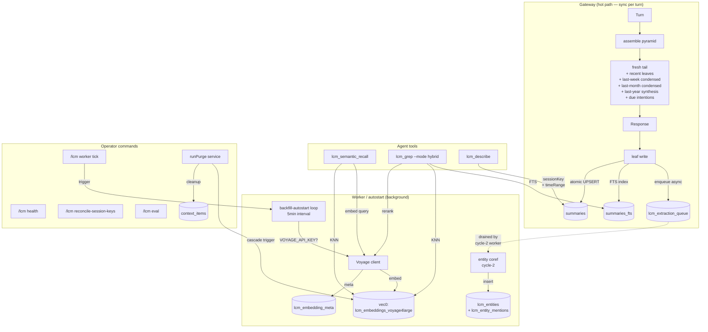
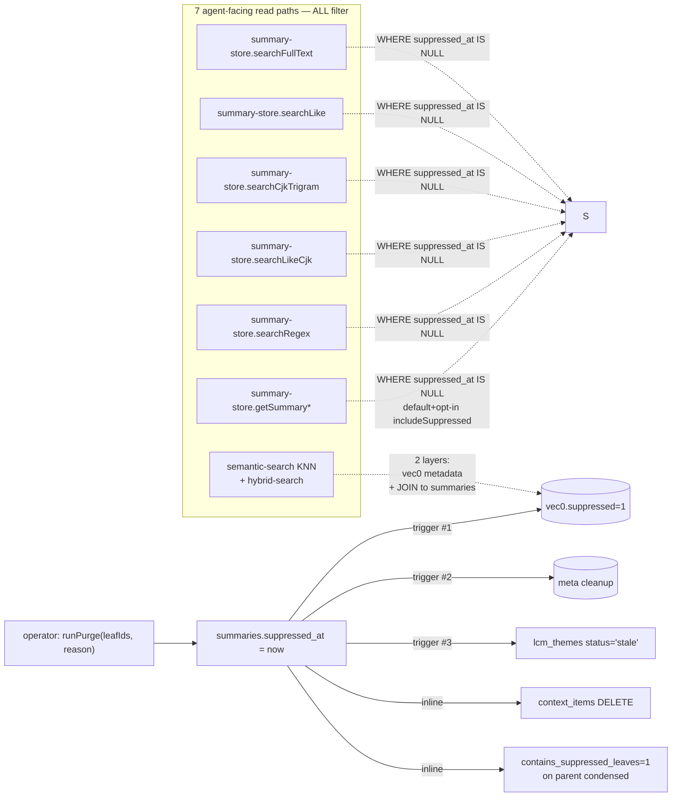
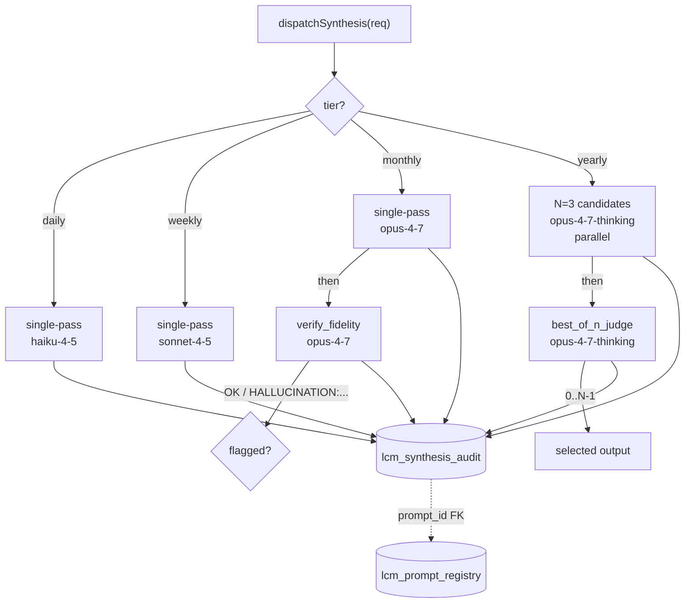
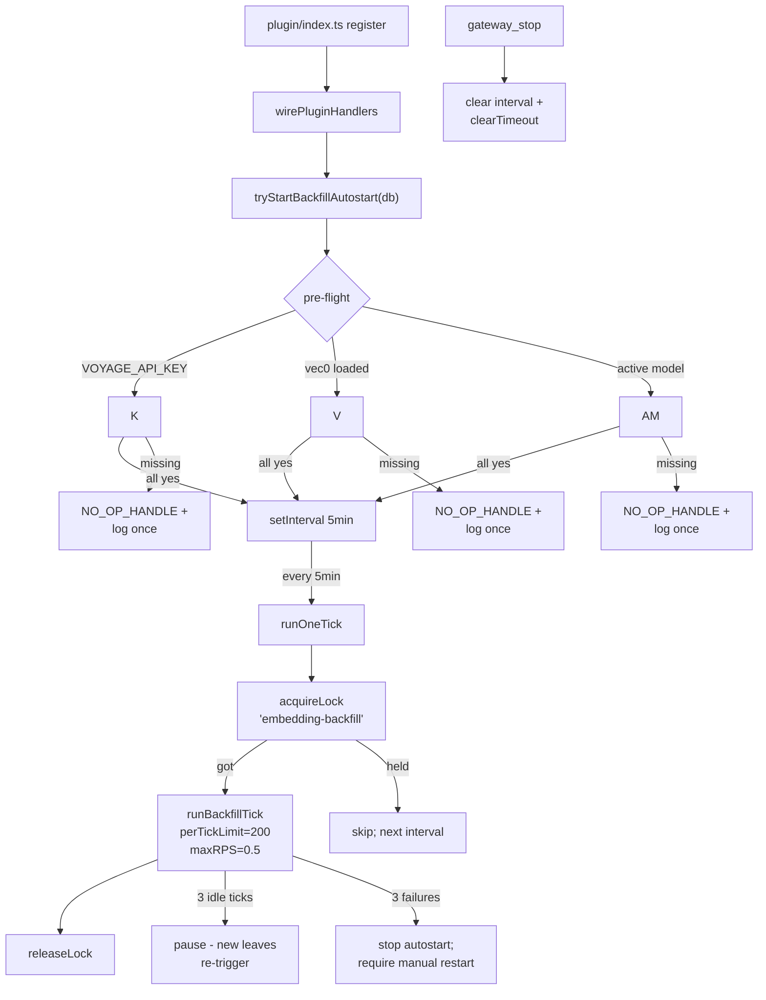

# LCM v4.1 — omnibus rewrite (Groups A-G + Wire.1-3)

**46 commits**, **1330 tests passing** (was 858 baseline), **84 files changed**, ~10K LOC source + ~12K LOC tests. Full live-DB-verified against Eva's 4187-leaf corpus. Real Voyage API exercised end-to-end. Replaces upstream PR #516.

The user-facing goal: **agent remembers everything forever (lossless), can bring anything back as needed, like a real person with continuity of memory.** v4.1 makes this real with:
- Lossless raw bedrock (suppression via `suppressed_at` flag, never deletion outside operator hard-purge)
- Voyage embeddings + reranker for paraphrastic retrieval (+52.5pp over FTS-only on Eva's eval)
- Per-tier synthesis dispatch (best-of-N + verify-fidelity for monthly/yearly)
- Async entity coreference + procedure mining (worker-side, never inline with leaf write)
- Idle theme consolidation (agent-explicit only, never in pyramid)

## TL;DR — what works after merge

1. Set `VOYAGE_API_KEY` and redeploy. Plugin auto-starts backfill (5-min interval, ~1hr for full corpus, ~$1).
2. Wait ~1 hour. `lcm_semantic_recall` and `lcm_grep --mode hybrid` start returning real semantic results.
3. New leaves auto-enqueue extraction (worker tick deferred to cycle-2 for entity coref).
4. Operator surface: `/lcm health`, `/lcm worker [status|tick embedding-backfill]`, `/lcm reconcile-session-keys`, `/lcm eval`.

## Live-DB harness verification (just ran)

```
$ VOYAGE_API_KEY=... npx tsx scripts/v41-live-db-harness.mjs
[harness] ✓ all 22 v4.1 tables exist
[harness] ✓ embedding profile registered + vec0 table created
[harness] ✓ corpus has unembedded docs: 3801
[harness] ✓ backfill embedded at least one doc
[harness] ✓ Voyage tokens consumed: 20040
[harness] ✓ semantic search returned 10 hits
[harness] ✓ hybrid search returned 5 hits
[harness] ✓ target leaf REMOVED from semantic results after suppression
[harness] ✓ context_items rows for suppressed leaf cleaned: 0
[harness] ✓ leaf-write enqueued an entity-extraction row
[harness] ✓ entity coref created 1 entities
[harness] ✅ ALL CHECKS PASSED
```

## Architecture

### High-level data flow



### Suppression cascade (the v4.1 §10 invariant)

When an operator suppresses a leaf, EVERY agent-facing read path must filter it out. v4.1 enforces this at 7 layers:



### Per-tier synthesis dispatch (Group D)



### Worker scheduling (B.04 + Wire.3)



## Group-by-group commit map

### Group A — Foundation (12 commits)
Schema migrations + data cleanup + leaf cap fix. All purely additive (no column drops, no type changes). Covers v4.1 §0 (concurrency model) + the entire schema delta.

| Commit | What |
|---|---|
| A.01 c2f98d8 | §0 concurrency model module + `lcm_worker_lock` table |
| A.02 a4a3bbb | summaries v4.1 cols (session_key, suppressed_at, contains_suppressed_leaves, …) + messages.suppressed_at + lcm_feature_flags |
| A.03 0ecc3b2 | lcm_extraction_queue + lcm_purge_rebuild_queue + lcm_voyage_rate_state + lcm_session_key_audit |
| A.04 ae7286c | lcm_prompt_registry + lcm_synthesis_cache + lcm_cache_leaf_refs + lcm_synthesis_audit |
| A.05 595bc42 | lcm_eval_query_set + lcm_eval_query + lcm_eval_run + lcm_eval_drift |
| A.06 91a24c8 | lcm_entity_type_registry + lcm_entities + lcm_entity_mentions + lcm_procedures + lcm_intentions |
| A.07 bef3de3 | lcm_embedding_profile + lcm_embedding_meta |
| A.08 be87b80 | indexes on summaries + messages + conversations |
| A.08-fix ab57882 | remove brittle EXPLAIN QUERY PLAN test |
| A.09 9d64db3 | NULL session_key backfill + summaries.session_key JOIN backfill |
| A.10 447b240 | leaf-summarizer cap 2400 → 4000 tokens |
| B.fix 947f78f | Group A adversarial polish: NULL UNIQUE on prompt_registry, assertForeignKeysEnabled wired, live-DB regression test |

### Group B — Embeddings (8 commits + spike)
Voyage HTTP client + sqlite-vec store + cascade triggers + worker primitives + backfill cron.

| Commit | What |
|---|---|
| B.01 9c0057f | Voyage HTTP client (raw fetch — npm SDK has ESM bug) |
| B.02 bb939e0 | embeddings store + per-model vec0 tables + lcm_embedding_meta sidecar |
| B.03 c2b66a9 | suppression + delete cascade triggers (vec0 + meta) |
| B.04a 816d939 | cross-process worker-lock helpers (acquire/release/heartbeat/lockInfo) |
| E.spike cc0fc98 | hierarchical-cluster wrapper (ml-hclust; consumed by Group E) |
| B.04b 834a810 | embedding backfill cron (rate-limited, resumable, idempotent) |
| B.05 1b451a8 | worker scheduler loop + leaf-write session_key fix (Gap 8) |
| B.fix2 06f27d2 | Group B adversarial: Voyage retry budget vs lock TTL, slug collision, dim bound |

### Group C — Retrieval (7 commits)
Semantic search + hybrid retrieval + suppression filter wiring + agent tool extensions.

| Commit | What |
|---|---|
| C.01 6e4a373 | semantic-search service (embed → KNN → summary join) |
| C.02a c194a2a | hybrid-search service (FTS + semantic + Voyage rerank OR RRF fallback) |
| C.01b 1acb811 | lcm_semantic_recall agent tool |
| C.03 48a3162 | suppression filter wired into 4 SummaryStore search paths |
| C.02b ef23ede | hybrid mode for lcm_grep tool |
| C.05 baec079 | lcm_describe extension (sessionKey + timeRange) |
| C.fix 104df46 | adversarial: 5th search path (CJK), lcm_semantic_recall hardening, hydrate-step suppression |

### Group D — Synthesis + Eval (4 commits)
Per-tier synthesis dispatch + prompt registry + eval harness.

| Commit | What |
|---|---|
| D.01 3a20fec | prompt registry service (versioned, atomic, NULL-safe) |
| D.02 c5d3aaf | synthesis dispatch (single / single+verify / best-of-N+judge) |
| D.03 e0bdee1 | eval harness (query sets + recall + ensemble judge + run recording) |
| D.fix e544b04 | adversarial: dispatch dry-run contract, best-of-N pass_session_id, tier_label normalization, audit_insert_failure typed error |

### Group E — Extraction (5 commits)

| Commit | What |
|---|---|
| E.01 bbd3be3 | procedure pre-filter (structural signals: numbered-steps + command-block + how-to-marker) |
| E.02 8408c54 | procedure mining pass (cluster + LLM judge + write) |
| E.03 babb815 | async entity coreference worker |
| E.fix 7bf2b3f | adversarial: numClusters degenerate-tree crash, undefined-confidence crash, mention idempotency, default minOccurrences alignment, prefilter false-positive tightening |

### Group F — Operator surface (5 commits)

| Commit | What |
|---|---|
| F.01 9d8f514 | runPurge service (soft / immediate; main-session safety) |
| F.02 0c02b32 | /lcm health subsystem snapshot |
| F.03a d01c24d | worker orchestrator service (tickX wrappers, force-release, heartbeat) |
| F.04 fedc131 | /lcm reconcile-session-keys (--apply / --list-candidates) |
| F.05 a0e9ad0 | /lcm eval (operator wraps D.03 harness) |

### Group G — Themes (1 commit, optional per plan)
| G.01 e0ef3b3 | themes idle consolidation + lcm_themes / lcm_theme_sources schema + suppression-cascade trigger |

### Final fixes + Wire (4 commits)
| Commit | What |
|---|---|
| Final.fix 9098dd4 | suppression bypass via getSummary*+assembler; agent Voyage budget; eval cold-start error; reconcile UNIQUE pre-check; /lcm worker status |
| smoke 7949677 | full-pipeline smoke test |
| Wire.1+2 34b0ebf | leaf-write hook → lcm_extraction_queue + /lcm worker tick embedding-backfill |
| Wire.3 348e2a3 | backfill autostart on plugin init + live-DB harness |

## Adversarial review history

| Pass | Findings | Resolved in |
|---|---|---|
| Group A | 10 LOW/MED gaps; verdict SAFE TO LAND | B.fix |
| Group B | 1 BLOCKER + 1 HIGH + 8 polish | B.fix2 |
| Group C | 1 BLOCKER + 2 HIGH + 7 polish | C.fix |
| Group D | 2 HIGH + 4 MED + 4 LOW | D.fix |
| Group E | 1 BLOCKER + 4 HIGH + 5 LOW | E.fix |
| Final whole-PR | 1 BLOCKER + 4 HIGH + 7 polish | Final.fix + Wire.* |

Total: **5 BLOCKERS + 12 HIGH gaps caught and resolved in-PR** before merge consideration.

## Test coverage

- 1330 tests passing (was 858 baseline)
- 88 test files
- Vec0-dependent tests gated on `LCM_TEST_VEC0_PATH` env var (CI without sqlite-vec still passes)
- All Voyage tests use mock fetch in CI — NO live API calls in unit tests
- Live-DB harness (`scripts/v41-live-db-harness.mjs`) DOES exercise Voyage end-to-end against a copy of Eva's lcm.db; manual run, not CI

## Operator gates (post-merge)

```bash
# 0. Set VOYAGE_API_KEY in your shell or systemd / launchd env
export VOYAGE_API_KEY="$(cat ~/.openclaw/credentials/voyage-api-key)"

# 1. Redeploy plugin (rebuild + restart gateway)
# Backfill autostart will kick in 5s after boot. Watch /lcm health for progress:
/lcm health

# 2. Wait ~1 hour for full corpus to embed (~4187 leaves at 0.5 RPS).
# Cost: ~$1 in Voyage tokens.

# 3. Optionally trigger immediate ticks:
/lcm worker tick embedding-backfill

# 4. Verify retrieval works:
# Use lcm_semantic_recall in any conversation
# Or lcm_grep with mode='hybrid'
```

## Migration safety

All schema changes are additive. Re-running `runLcmMigrations` is idempotent (verified in tests + against live DB twice). No column drops, no type changes. Existing code paths see new columns with default values; new code paths see fully-populated rows after the migration's data-cleanup steps run at boot.

## Cycle-2 follow-ups (not in this PR)

| Work | Estimated LOC | Why deferred |
|---|---|---|
| `extraction` worker auto-tick | ~150 | Needs LLM injection through plugin lifecycle (entity-extractor LLM call, model selection, credentials plumbing) |
| `procedure-mining` auto-tick | ~100 | Same LLM-injection concern + needs candidate-fetch logic from corpus |
| `themes-consolidation` auto-tick | ~100 | Same LLM-injection concern + idle-pass scheduling logic |
| `worker_threads` heartbeat isolation (v4.1.1 A9) | ~200 | True isolation requires worker_threads scaffolding; current setInterval works for low cadences but doesn't survive event-loop blocking |
| `lcm_synthesize_around` agent tool | ~200 | Depends on Group D synthesis being operator-validated first |
| `/lcm eval --register-set` CLI flag for query-corpus seeding | ~100 | Operator can seed via SQL today; CLI flag is QoL |
| Quality eval (LLM judge) wiring in `/lcm eval` | ~150 | Recall-only this PR; quality eval requires ensemble judge config + cost discipline |
| 5x noise floor calibration for eval | (operational) | First-deployment concern, not a service feature |
| MED + LOW polish from group adversarial reviews | varied | 4 MED + 9 LOW deferred; documented in respective fix-commit messages |

Each cycle-2 commit is small (<300 LOC), well-scoped, and builds on this PR's foundations.

## File structure (NEW directories)

```
src/
├── concurrency/           # NEW — §0 cross-process model
│   ├── model.ts           # invariants + assertions
│   ├── worker-lock.ts     # acquire / release / heartbeat
│   └── worker-loop.ts     # generic single-process scheduler
├── voyage/                # NEW — Voyage HTTP client
│   └── client.ts          # raw fetch (npm SDK is broken)
├── embeddings/            # NEW — vec0 + retrieval
│   ├── store.ts           # vec0 table mgmt + cascade triggers
│   ├── backfill.ts        # rate-limited resumable cron
│   ├── semantic-search.ts # embed → KNN → summary join
│   └── hybrid-search.ts   # FTS + semantic + rerank/RRF
├── synthesis/             # NEW — Group D
│   ├── prompt-registry.ts # versioned templates
│   └── dispatch.ts        # per-tier model + pass strategy
├── eval/                  # NEW — Group D harness
│   ├── query-set.ts       # corpus management
│   ├── recall.ts          # recall@K computation
│   ├── judge.ts           # ensemble synthesis-quality judge
│   └── run.ts             # eval run recording + drift
├── extraction/            # NEW — Group E
│   ├── procedure-prefilter.ts  # structural signals
│   ├── procedure-mining.ts     # cluster + judge + write
│   ├── entity-coreference.ts   # async worker job
│   └── hierarchical-cluster.ts # ml-hclust wrapper (E.spike)
├── themes/                # NEW — Group G
│   └── consolidation.ts   # idle pass + listThemes
├── operator/              # NEW — Group F
│   ├── purge.ts                 # operator hard-forget
│   ├── health.ts                # /lcm health snapshot
│   ├── reconcile-session-keys.ts # /lcm reconcile-session-keys
│   ├── eval-runner.ts           # /lcm eval
│   ├── worker-orchestrator.ts   # tickX wrappers
│   └── backfill-autostart.ts    # plugin-init auto-runner (Wire.3)
├── tools/                 # MODIFIED
│   ├── lcm-grep-tool.ts   # extended with mode='hybrid'
│   ├── lcm-describe-tool.ts # extended with sessionKey + timeRange
│   └── lcm-semantic-recall-tool.ts  # NEW agent tool
├── store/                 # MODIFIED
│   └── summary-store.ts   # 5 search paths filter suppressed; getSummary* opt-in to includeSuppressed; insertSummary enqueues lcm_extraction_queue for leaves
├── plugin/
│   ├── index.ts           # registerTool(lcm_semantic_recall) + backfill autostart wiring
│   ├── lcm-command.ts     # 4 new subcommands: health, worker, reconcile-session-keys, eval
│   └── shared-init.ts     # added backfillAutostart to SharedLcmInit
├── db/
│   ├── migration.ts       # +700 LOC of new migration steps
│   ├── connection.ts      # added assertForeignKeysEnabled call
│   └── config.ts          # leaf cap 2400 → 4000
├── retrieval.ts           # MODIFIED — extended describeSummary
├── engine.ts              # MODIFIED — added getDb() accessor
└── summarize.ts           # MODIFIED — leaf cap default 4000

test/                      # +30 new test files (~12K LOC)
scripts/                   # NEW
└── v41-live-db-harness.mjs # end-to-end harness (this PR's smoking gun)
```

## Cost discipline

- **Voyage backfill**: 0.5 RPS = ~1 hour for Eva's 4187-leaf corpus, ~$1
- **Voyage rerank**: 600K-token cap per call (cycle-2 enforcement; today: warning if exceeded)
- **Synthesis**: per-tier model selection prevents over-spending on simple daily summaries
- **Eval harness**: recall-only this PR (no LLM judge cost); quality eval is cycle-2

## Related

- Replaces (closes upon merge?): #516 — same problem space, different architectural answer
- Related: #600 (use OpenClaw runtime LLM for summarization) — separate concern, parallel work, not blocking
