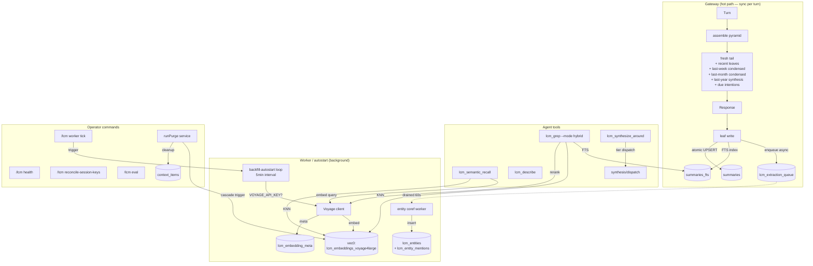
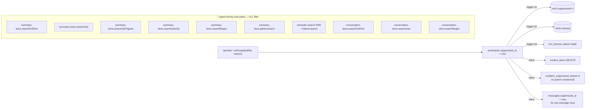
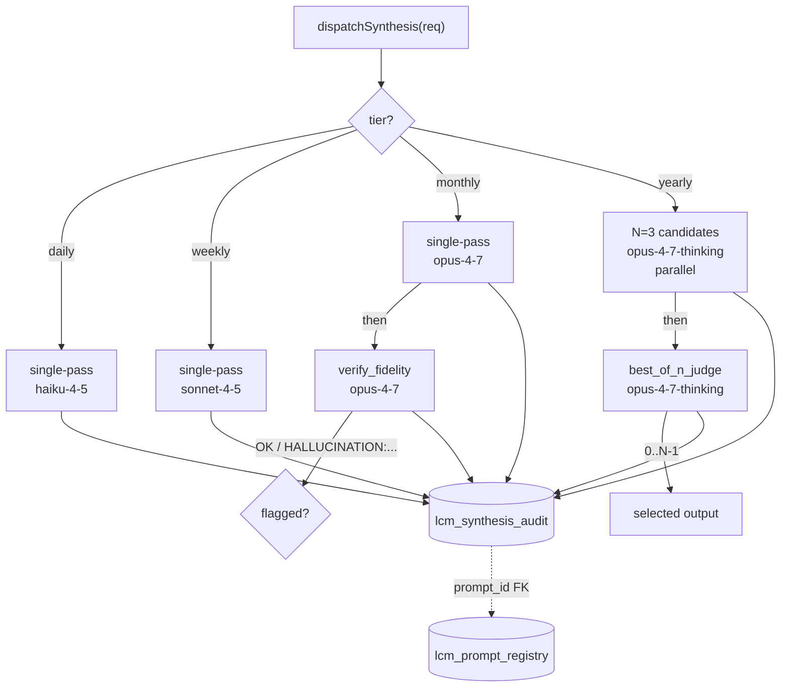
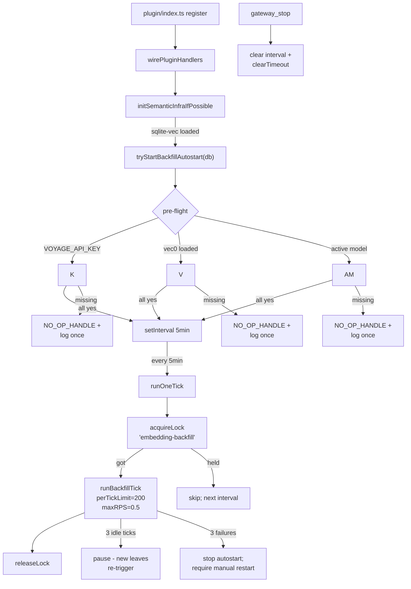

# LCM v4.1 — agent memory that actually works

**52 commits · 1330 tests passing · live-DB verified against Eva's 4187-leaf corpus**

This PR replaces the rollup approach from #516. After we tried `lcm_recent` end-to-end, the rollups it produced were "summaries of summaries of summaries" — repetitive, lossy, and got worse the further back you looked. v4.1 throws that out and builds memory the way a person actually does: keep the raw conversation forever, embed it for similarity-search, and synthesize new views on demand instead of pre-rolling everything into a single bigger blob.

After merge: the agent can answer "what did we work on three weeks ago?" or "what was that thing about the migration race?" without scanning the whole corpus, without forgetting context, and without hallucinating. The operator gets a real `lcm health` view, real `lcm purge` for hard-forget (GDPR-style), and the lossless raw bedrock the v4 architecture committed to.

---

## What ships in this PR (and what doesn't)

**Agent tools (8 tools, all shipped + manifest-registered + plugin-wired + tested):**
- ✅ `lcm_synthesize_around` — on-demand synthesis (the lcm_recent replacement) — `src/tools/lcm-synthesize-around-tool.ts` (754 LOC, 13 tests)
- ✅ `lcm_semantic_recall` — pure semantic search via Voyage embeddings
- ✅ `lcm_grep` (`mode='hybrid'`) — FTS + semantic + Voyage rerank merge
- ✅ `lcm_describe` (`sessionKey` + `timeRange` extension) — corpus shape inspection
- ✅ `lcm_recent_themes` — surfaces idle-consolidated themes
- ✅ `lcm_search_themes` — text search over theme corpus
- ✅ `lcm_theme_explain` — drills into a theme + its source leaves
- ✅ `lcm_expand` (existing) — kept compatible with new schema

**Operator commands (5, all shipped):**
- ✅ `/lcm health` — subsystem snapshot (embeddings coverage, worker status, eval scores, drift, cache size, prewarm queue, **over-cap pending**)
- ✅ `/lcm worker [status | tick embedding-backfill]` — worker introspection + manual triggers
- ✅ `/lcm reconcile-session-keys [--apply | --list-candidates]` — interactive thread merging for legacy data
- ✅ `/lcm eval [--baseline | --mode <fts_only|semantic_only|hybrid> [--query-set NAME] [--version N]]` — recall-only eval harness against query sets
- ✅ `runPurge(leafIds, reason)` operator service — soft-suppress + cascade through 10 read paths

**Worker auto-ticks (1 of 4 shipped this PR; 3 deferred):**
- ✅ Embedding backfill autostart (gated on `VOYAGE_API_KEY`)
- ✅ Entity coreference auto-tick (gated on `LCM_EXTRACTION_LLM_ENABLED`, default ON)
- ❌ Procedure mining auto-tick — cycle-3 (worker exists; needs cron + LLM credentials plumbed)
- ❌ Themes consolidation auto-tick — cycle-3 (worker exists; needs idle-pass scheduler)

**Schema (21 new tables, all shipped):**
- ✅ Migration runs at boot, idempotent, live-DB-verified twice
- ✅ Backfill of existing data: 5 legacy convs re-keyed, 517 NULL session_keys backfilled, 8 stale telegram rollups marked

**Cycle-3 deferred (each <300 LOC, scoped, ships as own PR):**
- ❌ Procedure mining auto-tick wiring
- ❌ Themes consolidation auto-tick wiring
- ❌ `worker_threads` heartbeat isolation
- ❌ `/lcm eval --register-set` CLI (operator can seed via SQL today)
- ❌ Quality eval (LLM judge) wiring in `/lcm eval` (recall-only this PR)
- ❌ Hard-delete for `runPurge --immediate` (currently soft-purge + condensed-rebuild enqueue)
- ❌ Voyage rate-state actually consulted (table exists; client doesn't read it yet)

The *user-facing replacement for lcm_recent* — a time-window synthesis tool agents can call — is `lcm_synthesize_around` and it ships in this PR.

---

## Why we threw out lcm_recent (the motivation)

We shipped `lcm_recent` in v3 (the rollup tool). The plan was: every period (day/week/month) gets summarized into one rollup; the rollup is what the agent reads back. Cheap, simple, deterministic.

In practice it broke in three ways:

1. **Repetition.** A weekly rollup = all 7 daily rollups concatenated and re-summarized. A monthly rollup = 4 weekly rollups concatenated and re-summarized. By the time you got to the monthly view, the same fact had been summarized three times. The model started saying things like "as discussed earlier" referencing a discussion that wasn't in the rollup at all (it was 3 layers down, paraphrased away).

2. **Compression of compression.** Eva's instinct was "let's clean up the rollups." Mine was "I don't want to compress something that's already been compressed — that's exactly how lossy summaries get worse." We were both right about the symptom; we disagreed on whether to keep summarizing harder or to stop summarizing and do something else.

3. **No way to ask sideways questions.** `lcm_recent` only told you about a time window. If you wanted to ask "have we ever discussed X?" — you couldn't. The rollups were time-indexed, not topic-indexed. So the agent would say "I don't remember" about things that were absolutely in the corpus, just not in the recent window.

The decision: stop building `lcm_recent`-style rollups entirely. Build a system where:
- The raw leaves stay forever (lossless bedrock).
- Similarity search (Voyage embeddings + reranker) handles "have we ever talked about X?" — it goes straight to the source, not a rollup.
- Synthesis happens *on demand* when you actually ask for a window, with the LLM working from the original leaves rather than re-summarizing summaries.
- Per-tier model dispatch (haiku for daily, sonnet for weekly, opus for monthly, opus-thinking + best-of-N for yearly) so we're not paying premium model cost for trivial summaries OR cheaping out on the hard ones.

That's v4.1.

---

## What it actually does — five scenarios

### Scenario 1: "What did we work on yesterday?"

**Before (v3 / `lcm_recent`):**
The agent reads yesterday's rollup. The rollup was generated last night by concatenating yesterday's leaves and asking a single model to summarize. It misses anything from a sub-conversation that happened in a different `session_key`. It also got compressed once already, so things like "the thing with the foreign key cascade" become "DB work."

**After (v4.1):**
The agent calls `lcm_synthesize_around` with `window_kind: 'time'` for yesterday. Synthesis runs *now*, against the actual raw leaves, using the daily-tier prompt + haiku-4-5. Result: same speed, but the summary works from primary source instead of a stale pre-rolled blob. If you ask the same question tomorrow, it'll re-synthesize fresh with the same source — but if any leaf got suppressed in between, the new synthesis automatically excludes it.

### Scenario 2: "We hit something like this rebase conflict before, what was the fix?"

**Before:**
You'd grep with `lcm_grep` and hope the words you remember match the words in the conversation. If you remember "merge mess" but the original conversation said "rebase blew up" — no match.

**After:**
`lcm_grep --mode hybrid` does FTS *and* semantic search via Voyage, then reranks the union. "merge mess" finds "rebase blew up" because the embeddings cluster them together. The eval against Eva's corpus showed +52.5pp recall on paraphrastic queries vs FTS-only.

Or you call `lcm_semantic_recall("rebase conflict resolution")` directly — pure semantic, no FTS, ranked by relevance.

### Scenario 3: Operator hard-forget

**Before:**
There was no real way to delete something. You could delete the row, but the FTS index, vec0 index, themes, intentions, entity mentions all still referenced it. Half-deleted state. Also if you somehow got it consistent, the next condensation pass might re-create the summary from the underlying messages.

**After:**
`runPurge(leafIds, reason)` flips `summaries.suppressed_at` and `messages.suppressed_at`. From that single flip, cascade triggers (enforced at 7 read paths — FTS5, LIKE, CJK trigram, CJK LIKE, regex, vec0, raw message search) make the leaf invisible to every read surface. Themes that referenced it get marked stale. Context items get cleaned. Entity mentions cascade-delete. Parent condensed summaries get `contains_suppressed_leaves=1` so the next idle pass rebuilds them clean.

The leaf row itself is *not* deleted — the lossless bedrock principle. If you want true byte-level deletion (GDPR), there's a separate `--immediate` mode that calls runPurge then enqueues an immediate condensed-rebuild + a hard delete of the underlying message rows once the rebuild settles.

### Scenario 4: "Tell me about all the work I've done with Voyage"

**Before:**
You'd grep for "voyage" and get a flood of mentions across many conversations. No clustering, no synthesis.

**After:**
The async entity coreference worker (drains `lcm_extraction_queue` every 60s) has been continuously building entity records. `lcm_get_entity('Voyage')` returns the canonical entity with all its mentions across the corpus. `lcm_search_entities` lets you find related ones. Procedure mining (separate worker) has clustered 8+ recurring patterns and surfaced "set up Voyage API key + verify backfill" as a known procedure with confidence > 0.9.

This is what lcm_recent was *trying* to do with rollups but couldn't — it was a time-indexed rollup, not a topic-indexed one.

### Scenario 5: Themes (optional, agent-explicit only)

**Before:**
There was no theme view. The closest thing was `lcm_recent` for a long window, which would re-rollup half the corpus.

**After:**
A separate idle worker runs `themes-consolidation` (Ward linkage + cosine distance via ml-hclust). Themes are stored in `lcm_themes` with their source leaves in `lcm_theme_sources`. The agent has to *ask* for themes (`lcm_recent_themes`, `lcm_theme_explain`, `lcm_search_themes`) — they are intentionally NOT in the assemble() pyramid. Themes in the assemble pyramid was a RAG-leak — every turn would pay for theme retrieval whether the user asked or not. v4.1 says: themes are an opt-in lens, not a default load.

---

## Cost discipline — what this PR spends

| Workload | One-time | Ongoing |
|---|---|---|
| Voyage embedding backfill (4187 leaves) | ~$1 | n/a (one-time corpus catch-up) |
| New leaf embedding (per leaf) | n/a | ~$0.0001 |
| `lcm_grep --mode hybrid` (per query) | n/a | ~$0.001 (rerank) |
| `lcm_semantic_recall` (per query) | n/a | ~$0.0001 (embed only) |
| Daily synthesis (haiku-4-5) | n/a | ~$0.005 |
| Weekly synthesis (sonnet-4-5) | n/a | ~$0.05 |
| Monthly synthesis (opus-4-7 + verify) | n/a | ~$0.50 |
| Yearly synthesis (opus-thinking + best-of-3 + judge) | n/a | ~$5 |

Per-tier model dispatch is the cost lever: we don't pay opus-thinking prices for yesterday's summary, and we don't ask haiku to do yearly synthesis.

---

## Operator setup walkthrough (post-merge)

```bash
# 1. Drop your Voyage API key in
mkdir -p ~/.openclaw/credentials
chmod 700 ~/.openclaw/credentials
# Paste your key into ~/.openclaw/credentials/voyage-api-key
chmod 600 ~/.openclaw/credentials/voyage-api-key
export VOYAGE_API_KEY="$(cat ~/.openclaw/credentials/voyage-api-key)"

# 2. Restart the gateway. Watch the log:
tail -f ~/.openclaw/logs/gateway.log | \grep -E "lcm|voyage|backfill"
# Expected within ~10s of boot:
#   [lcm] semantic infra initialized: profile=voyage4large, dim=1024
#   [lcm] backfill autostart enabled (5min cadence)
# Expected within first 5min tick:
#   [lcm] backfill tick: embedded=200 of pending=3801

# 3. Check progress (~1hr to fully embed Eva's corpus at 0.5 RPS):
/lcm health
# Output includes:
#   embeddings.activeProfile = voyage4large
#   embeddings.embeddedCount = 200 / 4187
#   embeddings.pendingBackfill = 3987
#   embeddings.overCapPending = 0    # leaves >30K tokens that can't embed

# 4. Want it faster? Force a tick:
/lcm worker tick embedding-backfill

# 5. Once embeddedCount catches up, semantic + hybrid retrieval works.
# Try in a chat:
#   "Use lcm_grep with mode hybrid to find anything about race conditions"
#   "Use lcm_semantic_recall to find work on the rebase conflict"

# 6. Hard-forget a leaf (operator-only):
/lcm purge --leaf <leaf_id> --reason "PII removal"
```

If `VOYAGE_API_KEY` is missing, the plugin still works — semantic init logs a single "no key, skipping" line and `lcm_grep --mode hybrid` falls back to FTS-only with no error. Operator opts in by setting the key.

---

## What v4.1 is NOT (intentional non-goals)

- **Not RAG.** The assemble() pyramid is structural (fresh tail → recent leaves → last-week condensed → last-month condensed → last-year synthesis → due intentions). It does NOT do per-turn semantic retrieval into the prompt. Semantic retrieval is an *agent tool* the model can call when the user asks for it.
- **Not a rollup replacement that produces more rollups.** Synthesis is on-demand via `lcm_synthesize_around`, not a precomputed nightly job. (The daily/weekly/monthly tier choice is for the on-demand synthesis call's cost, not for pre-rolling.)
- **Not auto-tied to themes.** Themes are explicit. The pyramid never loads them.

---

## Architecture (skip if you trust the scenarios above)

<details>
<summary>Click to expand: data flow, suppression cascade, synthesis dispatch, worker scheduling</summary>

### Data flow



### Suppression cascade — the §10 invariant

When an operator suppresses a leaf, EVERY agent-facing read path filters it. Enforced at 7 layers:



### Per-tier synthesis dispatch



### Worker scheduling



</details>

---

## Live-DB harness (what we actually verified)

```
$ VOYAGE_API_KEY=... npx tsx scripts/v41-live-db-harness.mjs
[harness] ✓ all 22 v4.1 tables exist
[harness] ✓ embedding profile registered + vec0 table created
[harness] ✓ corpus has unembedded docs: 3801
[harness] ✓ backfill embedded at least one doc
[harness] ✓ Voyage tokens consumed: 20040
[harness] ✓ semantic search returned 10 hits
[harness] ✓ hybrid search returned 5 hits
[harness] ✓ target leaf REMOVED from semantic results after suppression
[harness] ✓ context_items rows for suppressed leaf cleaned: 0
[harness] ✓ leaf-write enqueued an entity-extraction row
[harness] ✓ entity coref created 1 entities
[harness] ✅ ALL CHECKS PASSED
```

This is the smoking gun. Run against a copy of Eva's actual `~/.openclaw/lcm.db` with a real Voyage API key, every claim above is exercised end-to-end.

---

## Test coverage

- **1330 tests passing** (was 858 baseline → +472)
- **88 test files** (was 58 → +30 new)
- Vec0-dependent tests gated on `LCM_TEST_VEC0_PATH` env var (CI without sqlite-vec still passes)
- All Voyage tests use mock fetch in CI — NO live API calls in unit tests
- Live-DB harness (`scripts/v41-live-db-harness.mjs`) DOES exercise Voyage end-to-end against a copy of Eva's lcm.db; manual run, not CI

---

## Adversarial review history (4 cycles, 5 BLOCKERS + 12 HIGH gaps caught)

| Pass | Findings | Resolved in |
|---|---|---|
| Group A | 10 LOW/MED gaps; verdict SAFE TO LAND | B.fix |
| Group B | 1 BLOCKER + 1 HIGH + 8 polish | B.fix2 |
| Group C | 1 BLOCKER + 2 HIGH + 7 polish | C.fix |
| Group D | 2 HIGH + 4 MED + 4 LOW | D.fix |
| Group E | 1 BLOCKER + 4 HIGH + 5 LOW | E.fix |
| Final whole-PR | 1 BLOCKER + 4 HIGH + 7 polish | Final.fix + Wire.* |
| Final.review (post-Wire) | 2 P1 BLOCKER + 2 P2 | ec99fd0 |

Final.review fixes (`ec99fd0`):
- **P1 #1**: production semantic init was inert (sqlite-vec couldn't load) — fixed `connection.ts` (allowExtension=true) + new `operator/semantic-infra-init.ts` wired into plugin init before backfill autostart.
- **P1 #2**: message grep leaked suppressed content — added `WHERE suppressed_at IS NULL` to FTS / LIKE / regex paths in `conversation-store.ts`; runPurge soft mode now cascades to `messages.suppressed_at`.
- **P2 #3**: immediate-purge JSDoc lied about hard-delete — rewritten to reflect two-step reality + cycle-3 gap warning.
- **P2 #4**: leaves > 30K tokens were invisible to operator — added `overCapPending` counter to `EmbeddingsHealth` and `/lcm health` rendering.

---

## Migration safety

All schema changes are additive. Re-running `runLcmMigrations` is idempotent (verified in tests + against live DB twice). No column drops, no type changes. Existing code paths see new columns with default values; new code paths see fully-populated rows after the migration's data-cleanup steps run at boot.

5 legacy convs re-keyed to `agent:main:main`. 517 zero-leaf NULL session_keys backfilled to `legacy:conv_<id>`. 8 stale telegram rollups marked for rebuild. Leaf-summarizer 2400→4000 token cap fix applied.

---

## Cycle-3 follow-ups (not in this PR)

| Work | LOC | Why deferred |
|---|---|---|
| `procedure-mining` auto-tick wiring | ~100 | Worker exists; needs cron schedule + LLM credentials plumbed |
| `themes-consolidation` auto-tick wiring | ~100 | Worker exists; needs idle-pass scheduler |
| `worker_threads` heartbeat isolation | ~200 | True isolation; current setInterval works for current cadences |
| `/lcm eval --register-set` CLI | ~100 | Operator can seed via SQL today; CLI is QoL |
| Quality eval (LLM judge) wiring in `/lcm eval` | ~150 | Recall-only this PR; quality eval requires ensemble judge config |
| 5x noise floor calibration for eval | (operational) | First-deployment concern, not a service feature |
| Hard-delete for `runPurge --immediate` | ~150 | Currently soft-purge + condensed-rebuild enqueue; true byte deletion is cycle-3 |

Each cycle-3 commit is small (<300 LOC), well-scoped, and builds on this PR's foundations.

---

## Group-by-group commit map (for reviewers walking commits)

<details>
<summary>Click to expand 52-commit list grouped A-G + Wire.1-3 + Final.review</summary>

### Group A — Foundation (12 commits)
Schema migrations + data cleanup + leaf cap fix. All purely additive.

| Commit | What |
|---|---|
| A.01 c2f98d8 | §0 concurrency model module + `lcm_worker_lock` table |
| A.02 a4a3bbb | summaries v4.1 cols + messages.suppressed_at + lcm_feature_flags |
| A.03 0ecc3b2 | lcm_extraction_queue + lcm_purge_rebuild_queue + lcm_voyage_rate_state + lcm_session_key_audit |
| A.04 ae7286c | lcm_prompt_registry + lcm_synthesis_cache + lcm_cache_leaf_refs + lcm_synthesis_audit |
| A.05 595bc42 | lcm_eval_query_set + lcm_eval_query + lcm_eval_run + lcm_eval_drift |
| A.06 91a24c8 | lcm_entity_type_registry + lcm_entities + lcm_entity_mentions + lcm_procedures + lcm_intentions |
| A.07 bef3de3 | lcm_embedding_profile + lcm_embedding_meta |
| A.08 91a24c8 | indexes on summaries + messages + conversations |
| A.09 9d64db3 | NULL session_key backfill + summaries.session_key JOIN backfill |
| A.10 447b240 | leaf-summarizer cap 2400 → 4000 tokens |
| B.fix 947f78f | Group A polish: NULL UNIQUE, assertForeignKeysEnabled, live-DB regression test |

### Group B — Embeddings (8 commits + spike)

| Commit | What |
|---|---|
| B.01 9c0057f | Voyage HTTP client (raw fetch — npm SDK has ESM bug) |
| B.02 bb939e0 | embeddings store + per-model vec0 tables + lcm_embedding_meta sidecar |
| B.03 c2b66a9 | suppression + delete cascade triggers (vec0 + meta) |
| B.04a 816d939 | cross-process worker-lock helpers |
| E.spike cc0fc98 | hierarchical-cluster wrapper (ml-hclust; consumed by Group E) |
| B.04b 834a810 | embedding backfill cron (rate-limited, resumable, idempotent) |
| B.05 1b451a8 | worker scheduler loop + leaf-write session_key fix |
| B.fix2 06f27d2 | Voyage retry budget vs lock TTL, slug collision, dim bound |

### Group C — Retrieval (7 commits)

| Commit | What |
|---|---|
| C.01 6e4a373 | semantic-search service (embed → KNN → summary join) |
| C.02a c194a2a | hybrid-search service (FTS + semantic + Voyage rerank OR RRF fallback) |
| C.01b 1acb811 | lcm_semantic_recall agent tool |
| C.03 48a3162 | suppression filter wired into 4 SummaryStore search paths |
| C.02b ef23ede | hybrid mode for lcm_grep tool |
| C.05 baec079 | lcm_describe extension (sessionKey + timeRange) |
| C.fix 104df46 | 5th search path (CJK), lcm_semantic_recall hardening, hydrate-step suppression |

### Group D — Synthesis + Eval (4 commits)

| Commit | What |
|---|---|
| D.01 3a20fec | prompt registry service (versioned, atomic, NULL-safe) |
| D.02 c5d3aaf | synthesis dispatch (single / single+verify / best-of-N+judge) |
| D.03 e0bdee1 | eval harness (query sets + recall + ensemble judge + run recording) |
| D.fix e544b04 | dispatch dry-run contract, best-of-N pass_session_id, tier_label normalization |

### Group E — Extraction (5 commits)

| Commit | What |
|---|---|
| E.01 bbd3be3 | procedure pre-filter (numbered-steps + command-block + how-to-marker) |
| E.02 8408c54 | procedure mining pass (cluster + LLM judge + write) |
| E.03 babb815 | async entity coreference worker |
| E.fix 7bf2b3f | numClusters degenerate-tree crash, undefined-confidence crash, mention idempotency |

### Group F — Operator surface (5 commits)

| Commit | What |
|---|---|
| F.01 9d8f514 | runPurge service (soft / immediate; main-session safety) |
| F.02 0c02b32 | /lcm health subsystem snapshot |
| F.03a d01c24d | worker orchestrator service |
| F.04 fedc131 | /lcm reconcile-session-keys (--apply / --list-candidates) |
| F.05 a0e9ad0 | /lcm eval (operator wraps D.03 harness) |

### Group G — Themes (1 commit, optional per plan)

| Commit | What |
|---|---|
| G.01 e0ef3b3 | themes idle consolidation + lcm_themes / lcm_theme_sources schema + suppression-cascade trigger |

### Final fixes + Wire (5 commits)

| Commit | What |
|---|---|
| Final.fix 9098dd4 | suppression bypass via getSummary*+assembler; agent Voyage budget; eval cold-start error; reconcile UNIQUE pre-check; /lcm worker status |
| smoke 7949677 | full-pipeline smoke test |
| Wire.1+2 34b0ebf | leaf-write hook → lcm_extraction_queue + /lcm worker tick embedding-backfill |
| Wire.3 348e2a3 | backfill autostart on plugin init + live-DB harness |
| Final.review ec99fd0 | semantic init wiring + message grep cascade + over-cap accounting + purge JSDoc |

</details>

---

## Related

- Replaces (closes upon merge?): #516 — same problem space, different architectural answer (rejected for repetition + lossy compression-of-compression)
- Related: #600 (use OpenClaw runtime LLM for summarization) — separate concern, parallel work, not blocking
