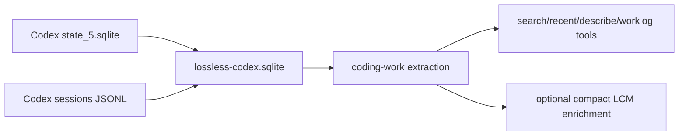

# Lossless Codex

Lossless Codex is a Codex Desktop plugin backed by a separate local SQLite sidecar database. It indexes Codex Desktop coding work as projects, threads, turns, tool calls, touched files, observations, summaries, and compact worklogs.

This plugin does not mutate Codex's live prompt context and does not dump raw Codex transcripts into OpenClaw LCM. LCM enrichment is compact, explicit, and disabled by default.

## Tools

- `lossless_codex_status`
- `lossless_codex_import`
- `lossless_codex_search`
- `lossless_codex_recent`
- `lossless_codex_describe`
- `lossless_codex_worklog`

## Defaults

- `LOSSLESS_CODEX_ENABLED=false`
- `LOSSLESS_CODEX_DB_PATH=${CODEX_HOME:-~/.codex}/lossless-codex.sqlite`
- `LOSSLESS_CODEX_SOURCE_DIR=${CODEX_HOME:-~/.codex}`
- `LOSSLESS_CODEX_INDEXER_ENABLED=false`
- `LOSSLESS_CODEX_READ_ONLY=true`
- `LOSSLESS_CODEX_INCLUDE_MESSAGE_TEXT=false`
- `LOSSLESS_CODEX_INCLUDE_TOOL_OUTPUTS=false`
- `LOSSLESS_CODEX_INCLUDE_LOG_BODIES=false`
- `LOSSLESS_CODEX_SUMMARY_MODEL=""`
- `LOSSLESS_CODEX_SUMMARY_PROVIDER=""`
- `LOSSLESS_CODEX_SUMMARY_MAX_CONCURRENCY=1`
- `LOSSLESS_CODEX_LCM_ENRICHMENT_ENABLED=false`

Raw message text, tool output, patch diffs, and log bodies are not indexed by default.

## Import Safety

`lossless_codex_import` requires explicit write permission. Either pass `allowWrite: true` for a deliberate manual import, or set both:

- `LOSSLESS_CODEX_INDEXER_ENABLED=true`
- `LOSSLESS_CODEX_READ_ONLY=false`

Search, recent, describe, and worklog reads are bounded. Sidecar summaries and LCM enrichment rows are memory cues, not proof for exact commands, paths, timestamps, or causal claims.

## LCM Enrichment

When `LOSSLESS_CODEX_LCM_ENRICHMENT_ENABLED=true`, `lossless_codex_worklog` can write a compact row into main LCM's `lcm_temporal_enrichments` table. The row contains project/day counts, a short summary, and `lossless-codex://...` refs back to the sidecar.

It never writes raw Codex message text, tool output, patch diffs, OpenClaw task state, Cortex memory, reminders, or Codex state.
