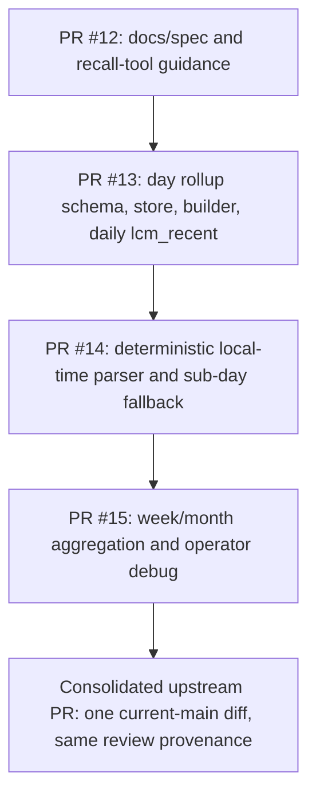
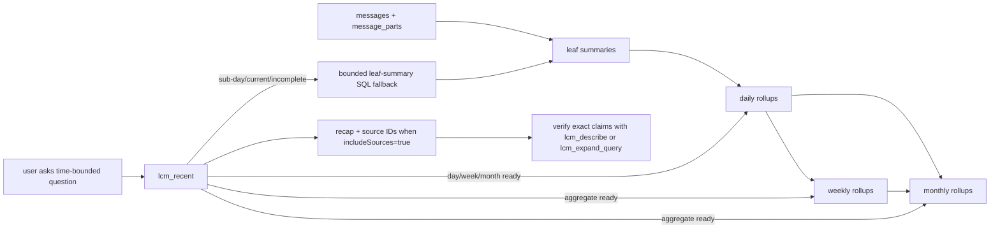
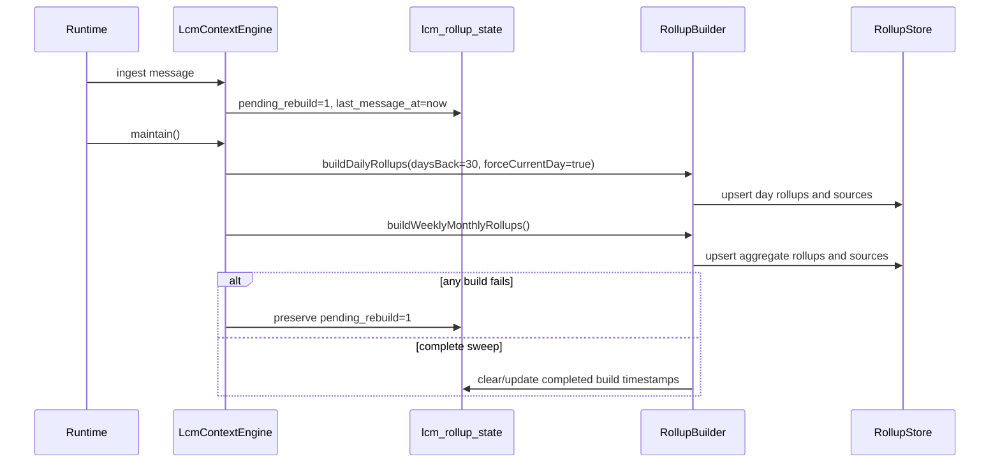
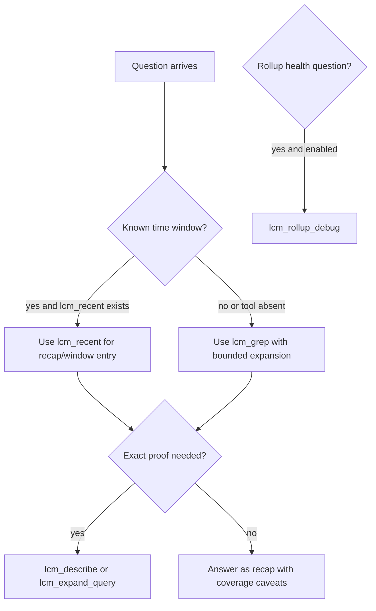

# LCM temporal memory implementation plan

Status: consolidated implementation and review map for the `lcm_recent` / temporal-memory rollout.
Date: 2026-04-28

## Goal

Make lossless-claw a temporal evidence layer, not just a transcript compaction and summary-DAG layer.

The product target is reliable answers to questions such as:

- What happened today / yesterday / last week / last month?
- What happened yesterday between 4 and 8 p.m. in my local timezone?
- What changed since a given incident started?
- What was the first/last occurrence of an emotionally or operationally important event?
- Did a blocker get resolved, and what is the current status?
- Which raw messages, summaries, files, or media artifacts support the answer?

LCM owns temporal evidence, provenance, and drilldown. Cortex owns curated durable semantic memory. GBrain/agents reason over LCM and Cortex through explicit tools. Behavioral/enrichment layers may annotate LCM artifacts, but should not replace LCM as the source of truth.

## Evidence base

This plan is based on local audits and prior architecture docs. The following names are external/private planning artifacts from the authoring environment, not repo-tracked paths, and this PR does not require them to exist in `docs/`:

- `R-515-lcm-rollup-pr-stack-gap-report-2026-04-28.md`
- `R-516-lcm-emotional-temporal-gap-report-2026-04-28.md`
- `R-517-lcm-operational-window-gap-report-2026-04-28.md`
- `R-518-lcm-temporal-architecture-gap-report-2026-04-28.md`
- `R-457-lcm-recent-architecture-2026-04-13.md`
- `R-459-lcm-recent-scenarios-2026-04-13.md`
- `R-473-salvage-ranking-2026-04-13.md`

The recovered PR stack contributed the implementation path. This consolidated branch ports that stack onto current `main` as one reviewable diff while preserving the original public PRs as review provenance.

This PR intentionally carries both the long-form implementation plan and user-facing skill/reference wording. The skill/reference wording remains safe for installed runtimes that have not deployed this feature because every `lcm_recent` and `lcm_rollup_debug` recommendation is gated on the tool being present in the current runtime.

## Consolidated implementation map

The public fork originally split this work across four reviewable PRs:

- PR #12, docs/spec: https://github.com/100yenadmin/lossless-claw/pull/12
- PR #13, daily rollups and initial `lcm_recent`: https://github.com/100yenadmin/lossless-claw/pull/13
- PR #14, sub-day local-time windows: https://github.com/100yenadmin/lossless-claw/pull/14
- PR #15, weekly/monthly rollups and debug tooling: https://github.com/100yenadmin/lossless-claw/pull/15

Those PRs remain useful review provenance, but the consolidated branch is easier for upstream maintainers to review because it is based on current `main` and avoids making reviewers chase stale conflict fixes across four branches. The code is still logically layered the same way:

### Runtime data flow

### Code map

| Layer | Code | Responsibility |
| --- | --- | --- |
| Migration | `src/db/migration.ts:1025`, `src/db/migration.ts:1078`, `src/db/migration.ts:1106` | Creates `lcm_rollups`, `lcm_rollup_sources`, `lcm_rollup_state`, lookup/fallback indexes, and day/week/month compatibility views in the existing migration transaction. |
| Store | `src/store/rollup-store.ts:66`, `src/store/rollup-store.ts:69`, `src/store/rollup-store.ts:352`, `src/store/rollup-store.ts:410` | Owns stable upserts, source replacement, stale/state tracking, source hiding support, and direct fallback reads. |
| Builder | `src/rollup-builder.ts:65`, `src/rollup-builder.ts:79`, `src/rollup-builder.ts:332`, `src/rollup-builder.ts:471` | Builds daily rows from leaf summaries, then aggregates complete daily coverage into week/month rows with provenance and source-message counts. |
| Engine hook | `src/engine.ts:1454`, `src/engine.ts:1544`, `src/engine.ts:4745`, `src/engine.ts:5071`, `src/engine.ts:6684` | Instantiates rollup services, marks conversations dirty on ingest, rebuilds day/week/month rollups after maintenance, and exposes stores to tools. |
| `lcm_recent` | `src/tools/lcm-recent-tool.ts:539`, `src/tools/lcm-recent-tool.ts:611`, `src/tools/lcm-recent-tool.ts:1109` | Parses deterministic periods/windows, prefers ready rollups when appropriate, and uses bounded SQL fallback for sub-day/current/incomplete periods. |
| `lcm_rollup_debug` | `src/tools/lcm-rollup-debug-tool.ts:46`, `src/tools/lcm-rollup-debug-tool.ts:87`, `src/tools/lcm-rollup-debug-tool.ts:142` | Operator-only rollup inspection, strict period validation, and source ID hiding unless `includeSources=true`. |
| Plugin/config | `src/plugin/index.ts:2057`, `src/plugin/index.ts:2063`, `src/db/config.ts:431`, `openclaw.plugin.json:200` | Registers `lcm_recent` by default, registers `lcm_rollup_debug` only when explicitly enabled, and documents the config knob. |
| Skill docs | `skills/lossless-claw/SKILL.md:17`, `skills/lossless-claw/SKILL.md:37`, `skills/lossless-claw/references/recall-tools.md:7`, `skills/lossless-claw/references/recall-tools.md:23` | Gates recommendations on tool availability and states the recap-vs-proof rule. |
| Tests | `test/rollup-store-builder.test.ts` | Covers rollup schema/builds, invalid dates, DST gaps, UTC+13 rollover, fallback source hiding, aggregate provenance/retry behavior, debug redaction, and fingerprint invalidation. |

### Maintenance and freshness loop

### Tool selection contract

`lcm_recent` is intentionally not a proof tool. It is the fastest entry point for likely windows, source IDs, and first-pass recap. Exact commands, paths, timestamps, root cause, and "what shipped" claims still require source verification through `lcm_describe`, `lcm_expand`, or `lcm_expand_query`.

## Current gap summary

Current stock tools (`lcm_grep`, `lcm_describe`, `lcm_expand`, `lcm_expand_query`) can reconstruct temporal context indirectly, but they require manual stitching and LLM-assisted expansion.

The missing first-class capabilities are:

1. Stable calendar rollups with provenance and freshness.
2. Deterministic local-time window parsing and retrieval.
3. Sub-day windows such as `yesterday 4-8pm`.
4. Event-time vs ingest-time separation.
5. First/last occurrence semantics.
6. Status-transition and current-status reconstruction.
7. Modality/media linkage for voice, files, and attachments.
8. Episode/cross-window continuity for incidents and project threads.
9. Debug/admin tools for rollup coverage, stale rows, and rebuilds.
10. Privacy- and scope-aware cross-conversation behavior.

## PR sequence

### PR 1: daily/window foundation

Purpose: land a trustworthy daily-rollup substrate before higher-level features depend on it.

Scope:

- Add canonical rollup schema: `lcm_rollups`, `lcm_rollup_sources`, `lcm_rollup_state`.
- Add compatibility views for daily/weekly/monthly if useful, but only daily must be materialized in PR 1.
- Add `RollupStore` with stable row identity. Do not replace canonical `rollup_id` on conflict.
- Add daily `RollupBuilder`.
- Add `lcm_recent` for `today`, `yesterday`, `date:YYYY-MM-DD`, `7d`, `30d`, `week`, and `month`, with honest fallback/coverage reporting.
- Wire maintenance so daily rollups can actually build after relevant summaries/messages change.
- Replace empty-query / wildcard all-conversations fallback with a safe bounded path.
- Enforce baseline scope/privacy rules for all-conversation paths: explicit opt-in, no implicit cross-conversation aggregation, hard result caps, and output metadata when results are truncated.

Acceptance tests:

- Migration creates expected tables/views idempotently.
- Daily rollup build is idempotent.
- Rebuilding a day preserves canonical rollup identity.
- New summaries mark relevant daily rollups stale or pending rebuild.
- `lcm_recent(today|yesterday|date:...)` returns rollup data when present and an explicit fallback when absent.
- All-conversations mode is bounded, explicit, and does not use empty full-text wildcard search.
- Bounded fallback uses concrete caps, such as at most 20 returned leaf summaries per request, deterministic ordering, and truncation/fallback status in output.

### PR 2: deterministic local-time windows and sub-day grammar

Purpose: make exact operational windows possible without manual UTC conversion.

Scope:

- Add timezone-aware range resolver for named periods and explicit intervals.
- Use deterministic timezone precedence: explicit tool timezone when supported, then effective LCM/runtime timezone, then configured/system fallback.
- Support examples such as `yesterday 4-8pm`, `yesterday between 16:00 and 20:00`, `last 90m`, `morning`, `afternoon`, `evening`, and date-bounded ranges.
- Distinguish rollup retrieval from bounded evidence search: sub-day queries should drill into bounded summaries/messages rather than pretending a whole-day rollup is precise enough.
- Return UTC window, local window, timezone, coverage, and fallback reason.
- Treat intervals as `[start, end)`. Reject impossible calendar dates and nonexistent local wall-clock times instead of silently normalizing them.

Acceptance tests:

- Fixed-time tests for Asia/Bangkok and a DST-observing timezone.
- `yesterday 4-8pm` resolves to the correct UTC interval.
- Boundaries are consistently documented as `[start, end)`.
- Sub-day retrieval only includes evidence inside the requested local-time window unless explicitly marked as adjacent context.

### PR 3: weekly/monthly builders and admin/debug tools

Purpose: make calendar aggregation real rather than read-path-only.

Scope:

- Build weekly rollups from daily rollups.
- Build monthly rollups from weekly and/or daily rollups.
- Add invalidation propagation: day -> week -> month.
- Add freshness and coverage metadata.
- Add debug/admin surfaces such as `lcm_rollup_list`, `lcm_rollup_describe`, and a rebuild entrypoint if appropriate for the OpenClaw tool surface.

Acceptance tests:

- Week rollup builds from daily rows and records provenance.
- Month rollup builds from week/day rows and records provenance.
- Updating a daily row marks containing week/month stale.
- Debug tool output shows period, coverage, freshness, source counts, and stale reasons.

### PR 4: event-time, first/last occurrence, modality, and status transitions

Purpose: handle scenarios that calendar summaries alone cannot answer.

Scope:

- Add explicit event-time vs ingest-time metadata where possible.
- Add first/last occurrence query semantics over messages, summaries, files, and rollups.
- Add modality/media metadata linkage for files, audio, images, transcripts, and generated artifacts.
- Add status-transition extraction/annotation hooks for started/blocked/resolved/reopened/current-state.
- Keep derived annotations provenance-backed and confidence-labeled.

Acceptance tests:

- A retelling does not override an earlier primary occurrence unless evidence supports it.
- A first-occurrence query can distinguish original event, later echo, and imported summary.
- Voice/media-linked evidence can be surfaced with text summary plus artifact reference.
- Status query returns current state, transitions, evidence, and confidence.

### PR 5: episode/cross-window continuity and integration contracts

Purpose: support incidents and project arcs spanning hours/days/conversations.

Scope:

- Add episode grouping/search primitives for incidents and project threads.
- Add cross-window continuity retrieval for `since X`, `before/after`, and day-boundary-spanning work.
- Define explicit contracts for Cortex, GBrain, and BIL/enrichment consumers.
- Extend PR1 baseline privacy/scope rules for advanced cross-conversation aggregation and episode continuity.

Acceptance tests:

- A multi-party onboarding window reconstructs phases, final state, blockers, artifacts, and confidence.
- A named production incident reconstructs root cause, repair actions, final verification, and follow-up ticket.
- Emotional first-occurrence scenario returns moderate confidence when primary evidence is indirect and names the evidence gap.

## Non-goals for the first PR

- No yearly rollups in PR 1.
- No opaque LLM-only synthesis path as the primary implementation.
- No mutation of the installed OpenClaw extension or live user database as part of PR development.
- No conversion of Cortex into a raw transcript store.
- No GBrain scraping of LCM internals; use explicit LCM tools/contracts.

## Deployment discipline

Each PR should include:

- focused tests,
- a changeset when user-facing behavior changes,
- docs/tool reference updates when tool surfaces change,
- migration idempotence tests,
- provenance/coverage/fallback behavior in the output contract.

The first PR should prove the substrate is safe before weekly/monthly/event layers are built.
